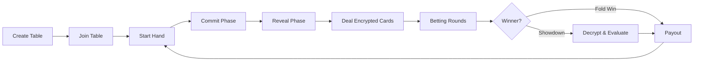

# 5-Seat Texas Hold'em

A decentralized 5-seat Texas Hold'em poker game built on the Cedra blockchain with Move smart contracts and a React frontend.

## 🎮 Game Flow



## 📁 Project Structure

```
5-seat-texas-holdem/
├── packages/
│   ├── contracts/          # Move smart contracts
│   │   ├── sources/        # Contract source files
│   │   ├── tests/          # Contract tests (86 tests)
│   │   ├── docs/           # Contract documentation
│   │   └── Move.toml       # Move package config
│   └── frontend/           # React + TypeScript frontend
│       ├── src/            # Frontend source code
│       └── package.json    # Frontend dependencies
├── package.json            # Workspace root config
└── README.md
```

## 🚀 Getting Started

### Prerequisites

- [Node.js](https://nodejs.org/) (v18+)
- [Cedra CLI](https://docs.cedra.network/) for smart contract development

### Installation

```bash
# Install all dependencies (from root)
npm install
```

### Development

#### Frontend

```bash
# Start the frontend development server
npm run dev

# Build for production
npm run build

# Preview production build
npm run preview
```

#### Smart Contracts

```bash
# Compile contracts
npm run contracts:compile

# Run contract tests
npm run contracts:test
```

## 📜 Smart Contracts

The Move smart contracts handle:

| Module | Description |
|--------|-------------|
| `texas_holdem.move` | Core game logic (Move Object tables, encrypted cards, betting) |
| `chips.move` | Chip/token management (1000 chips = 1 CEDRA; 1 chip = 0.001 CEDRA) |
| `hand_eval.move` | Poker hand evaluation (High Card → Royal Flush) |
| `pot_manager.move` | Pot calculation and side pot management |
| `poker_events.move` | 25 on-chain event types |

### Current Deployment

- **Network:** Cedra Testnet
- **Address:** `0xa24365cad90b74eca7f078f8c91b327c0716bcea3ed64dc9d97027b605b4fcfa`
- **Version:** 7.0.1 (close_table fix)
- **Fee Rate:** 0.5% (with fractional accumulator for precise collection)

See [`packages/contracts/docs/DOCUMENTATION.md`](packages/contracts/docs/DOCUMENTATION.md) for detailed contract documentation.

See [`packages/contracts/docs/DEPLOYMENT.md`](packages/contracts/docs/DEPLOYMENT.md) for deployment history and instructions.

## 🔒 Security Features (v7.0.0)

This version includes comprehensive security improvements from the second audit:

| Feature | Description |
|---------|-------------|
| **Non-Custodial Tables** | Tables are Move Objects; funds held at table address, not admin |
| **Encrypted Hole Cards** | XOR-encrypted with per-player keys derived from secrets |
| **Input Validation** | Commit hashes (32 bytes) and secrets (16-32 bytes) validated |
| **One Seat Per Address** | Same address cannot occupy multiple seats |
| **Block Height Randomness** | Uses block height instead of manipulable timestamps |
| **Exact Chip Multiples** | Enforces 0.001 CEDRA (1 chip) multiples; no rounding loss |

## 🚀 GitHub Pages Deployment

This repo includes a GitHub Actions workflow that builds the frontend and deploys it to GitHub Pages on every push to `main`.

1. In GitHub, go to **Settings → Pages**.
2. Set **Source** to **GitHub Actions**.

Once enabled, the site will publish at:

`https://<org-or-user>.github.io/<repo>/`

## 🎰 Features

### Game Features
- ✅ 5-seat poker tables
- ✅ Configurable blinds, antes, and straddles
- ✅ Side pot management
- ✅ Commit-reveal randomness for fair shuffling
- ✅ Timeout handling with auto-fold
- ✅ All-in runout (auto-deal remaining cards)

### Admin Features
- ✅ Table creation and configuration
- ✅ Player management (kick, force sit-out)
- ✅ Emergency abort (refund all bets)
- ✅ Pause/resume tables
- ✅ Transfer table ownership

### Fee System
- ✅ 0.5% service fee on all pots
- ✅ Fractional accumulator for precise collection
- ✅ Configurable fee collector address

## 🎨 Frontend

The React frontend provides:

- Wallet connection (Zedra Wallet)
- Table browsing and creation
- Real-time game interface with card display
- Player actions (fold, check, call, raise, all-in)
- Commit-reveal workflow for fair dealing
- Showdown results with hand rankings

## 🔧 Configuration

### Environment Variables

Create `packages/frontend/.env`:

```env
VITE_NETWORK=testnet
VITE_CONTRACT_ADDRESS=0xda25a2e27020e30031b4ae037e6c32b22a9a2f909c4bfecc5f020f3a2028f8ea
```

## 📄 License

Proprietary — Copyright (c) 2025 Singularity Shift Ltd & Spielcrypto Ltd. All rights reserved.
