# Deployment Guide - 5-Seat Texas Hold'em

## Latest Deployment

**Version:** 7.0.1 (close_table fix)  
**Date:** 2025-12-27  
**Network:** Cedra Testnet

### Contract Address
```
0xa24365cad90b74eca7f078f8c91b327c0716bcea3ed64dc9d97027b605b4fcfa
```

### Fee Configuration
- **Fee Rate:** 0.5% (50 basis points)
- **Fee Collector:** `0xb40f35d81198adc541df553d429653fdffc32163e44228433d7d2ec0fa05bf87`
- **Fee Admin:** `0xa24365cad90b74eca7f078f8c91b327c0716bcea3ed64dc9d97027b605b4fcfa`

### Transaction
- **Deploy Hash:** `0x23071e16a26c4e45720d3ee499482ff2ef1d3637ee0459f043bf02efaf78437c`
- **Explorer:** [View on Cedrascan](https://cedrascan.com/txn/0x23071e16a26c4e45720d3ee499482ff2ef1d3637ee0459f043bf02efaf78437c?network=testnet)
- **Status:** ✅ Executed successfully
- **Gas Used:** 29,272 units

### Deployed Modules
- `chips` - Chip token system (FA-based) with exact multiple validation
- `hand_eval` - Hand evaluation logic
- `pot_manager` - Pot & side pot management
- `poker_events` - 25 event types
- `texas_holdem` - Core game logic with Move Object escrow + encrypted cards

### Profile
- **Name:** `holdem_deployer_v7`
- **Network:** Testnet

### Changes in v7.0.1

- **Fixed:** `close_table` now removes `TableRef` from admin address, allowing new table creation
- **Added:** `cleanup_table_ref` function for migration from older contract versions

### Changes in v7.0.0 (Second Audit Remediation)

All 7 findings from the second security audit have been addressed:

| Finding | Severity | Fix |
|---------|----------|-----|
| **CRITICAL-1** | Critical | Hole cards XOR-encrypted with per-player keys |
| **HIGH-1** | High | Tables are Move Objects with ExtendRef for non-custodial escrow |
| **MEDIUM-1** | Medium | Commit hash (32 bytes) and secret (16-32 bytes) size validation |
| **MEDIUM-2** | Medium | One address cannot join multiple seats |
| **MEDIUM-3** | Medium | Graceful FeeConfig handling |
| **MEDIUM-4** | Medium | Block height randomness instead of timestamp |
| **LOW-1** | Low | Exact chip multiples required (no rounding loss) |
| **LOW-2** | Low | SessionStorage for secrets (cleared on browser close) |

- **86 tests** now passing

---

## Contract Workflow Diagram

```mermaid
flowchart TB
    subgraph Setup["🎰 Table Setup"]
        A[Deploy Contract] --> B[init_fee_config]
        B --> C[create_table]
        C -->|Creates Move Object| D[Table Object Created]
        D --> E[join_table]
    end
    
    subgraph HandFlow["🃏 Hand Lifecycle"]
        F[start_hand] --> G[COMMIT Phase]
        G -->|submit_commit| H{All Committed?}
        H -->|No| G
        H -->|Yes| I[REVEAL Phase]
        I -->|reveal_secret| J{All Revealed?}
        J -->|No| I
        J -->|Yes| K[Deal Encrypted Cards]
    end
    
    subgraph Betting["💰 Betting Rounds"]
        K --> L[PREFLOP]
        L -->|fold/check/call/raise| M{Round Complete?}
        M -->|No| L
        M -->|Yes| N{One Player Left?}
        N -->|Yes| R[Fold Win]
        N -->|No| O[FLOP]
        O --> P[TURN]
        P --> Q[RIVER]
        Q --> S[SHOWDOWN]
    end
    
    subgraph Resolution["🏆 Resolution"]
        S --> T[Decrypt & Evaluate Hands]
        R --> U[Calculate Fee]
        T --> U
        U --> V[Distribute Pot from Table Object]
        V --> W[Next Hand]
        W --> F
    end
    
    Setup --> HandFlow
```



---

## Quick Start

```bash
# Set contract address
export ADDR=0xda25a2e27020e30031b4ae037e6c32b22a9a2f909c4bfecc5f020f3a2028f8ea

# Buy chips (0.1 CEDRA = 100 chips) - must be exact multiple!
cedra move run --function-id $ADDR::chips::buy_chips \
  --args u64:100000000 --profile holdem_deployer_v6

# Create table (5/10 blinds, 100-10000 buy-in, no ante, straddle enabled)
cedra move run --function-id $ADDR::texas_holdem::create_table \
  --args u64:5 u64:10 u64:100 u64:10000 u64:0 bool:true \
  --profile holdem_deployer_v6

# Get table object address (required for joining)
cedra move view --function-id $ADDR::texas_holdem::get_table_address \
  --args address:<ADMIN_ADDR> --profile holdem_deployer_v6

# Join table at seat 0 with 500 chips (use TABLE_OBJECT_ADDRESS from above)
cedra move run --function-id $ADDR::texas_holdem::join_table \
  --args address:<TABLE_OBJECT_ADDRESS> u64:0 u64:500 --profile holdem_deployer_v6
```

---

## Post-Deployment Fee Setup

After deploying, initialize the fee collector (run once):

```bash
cedra move run \
  --function-id $ADDR::texas_holdem::init_fee_config \
  --args address:<FEE_COLLECTOR_ADDRESS> \
  --profile holdem_deployer_v6
```

To update the fee collector later:

```bash
cedra move run \
  --function-id $ADDR::texas_holdem::update_fee_collector \
  --args address:<NEW_FEE_COLLECTOR_ADDRESS> \
  --profile holdem_deployer_v6
```

---

## Previous Deployments

| Version | Date | Address | Profile | Notes |
|---------|------|---------|---------|-------|
| 1.0.0 | 2025-12-21 | `0x736ddb...557b` | holdem_testnet | Initial edge-case fixes |
| 2.0.0 | 2025-12-21 | `0x88d4e4...665f` | holdem_v2 | Frontend integration |
| 3.0.0 | 2025-12-22 | `0xb45d81...574b` | holdem_deployer_V1 | Bug fixes + Admin controls |
| 4.0.0 | 2025-12-23 | `0xfab3ac...1fd3` | holdem_deployer_v2 | Hole cards display |
| 4.1.0 | 2025-12-25 | `0x6ff41e...9aa3` | holdem_deployer_v3 | Service fees (per-table) |
| 5.0.0 | 2025-12-25 | `0x238498...2d5a` | holdem_deployer_v4 | Global fee collector |
| 6.0.0 | 2025-12-26 | `0x4d5a5f...dbf5` | holdem_deployer_v5 | Fractional fee accumulator |
| 7.0.0 | 2025-12-27 | `0xda25a2...f8ea` | holdem_deployer_v6 | Second audit remediation |

---

## Redeployment

```bash
# Create new profile
cedra init --profile <name> --network testnet

# Deploy with named address (may need --override-size-check for large packages)
cedra move publish --profile <name> \
  --named-addresses holdemgame=<PROFILE_ADDRESS> \
  --assume-yes --override-size-check

# Initialize fee collector (required!)
cedra move run --function-id <ADDR>::texas_holdem::init_fee_config \
  --args address:<FEE_COLLECTOR_ADDRESS> --profile <name>
```

---

## Frontend Configuration

Update `packages/frontend/.env`:
```
VITE_CONTRACT_ADDRESS=0xda25a2e27020e30031b4ae037e6c32b22a9a2f909c4bfecc5f020f3a2028f8ea
```

Or update `packages/frontend/src/config/contracts.ts`:
```typescript
export const CONTRACT_ADDRESS = "0xda25a2e27020e30031b4ae037e6c32b22a9a2f909c4bfecc5f020f3a2028f8ea";
```

---

## Security Notes (v7.0.0)

### Non-Custodial Table Funds
Tables are now Move Objects. Player funds are held at the table's object address, not the admin's address. The module controls fund transfers via `ExtendRef`.

### Encrypted Hole Cards
Cards are XOR-encrypted using keys derived from each player's commit secret. Only the player who knows their secret can decrypt their cards.

### Randomness
Deck shuffling uses block height plus fixed commit/reveal deadlines, eliminating timestamp manipulation attacks.

