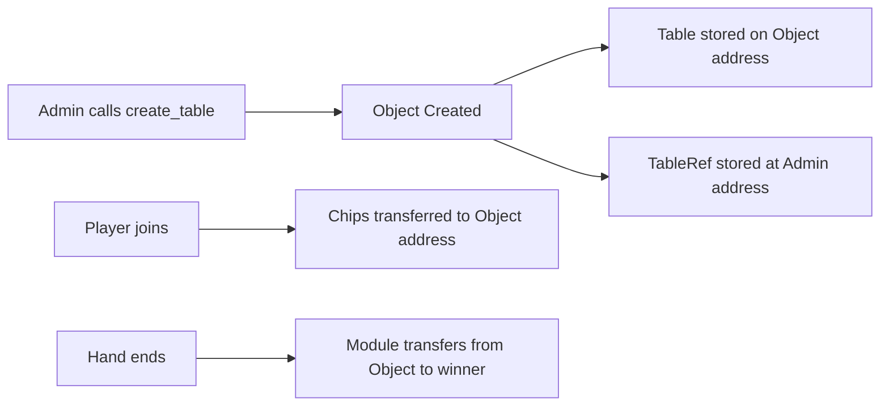
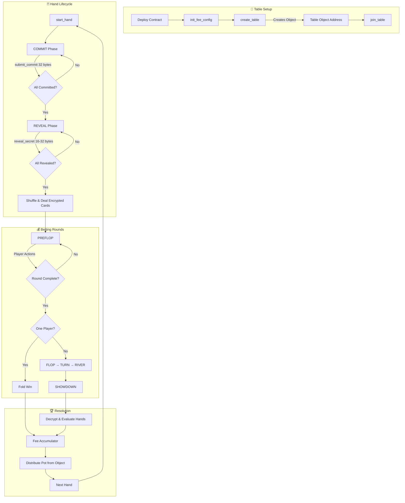

# 5-Seat Texas Hold'em - Technical Documentation

**Version:** 7.0.0 (Second Audit Remediation)  
**Last Updated:** 2025-12-27

## Overview

A fully on-chain casino-grade Texas Hold'em poker game for 5 players, built on the Cedra blockchain using the Move programming language.

### Security Features (v7.0.0)

| Feature | Description |
|---------|-------------|
| **Non-Custodial Tables** | Tables are Move Objects with module-controlled funds |
| **Encrypted Hole Cards** | XOR encryption with per-player SHA3-256 derived keys |
| **Input Validation** | Commits (32 bytes) and secrets (16-32 bytes) validated |
| **One Seat Per Address** | Same address cannot occupy multiple seats |
| **Block Height Randomness** | Uses block height instead of manipulable timestamps |
| **Exact Chip Multiples** | No silent rounding loss on chip purchases |

---

## Architecture

```
┌─────────────────────────────────────────────────────────────┐
│                        texas_holdem.move                     │
│        (Core Game Logic, Move Object Tables, Encryption)     │
├─────────────────────────────────────────────────────────────┤
│     poker_events.move     │        pot_manager.move          │
│       (25 Event Types)    │      (Pot & Bet Tracking)        │
├───────────────────────────┼──────────────────────────────────┤
│       chips.move          │         hand_eval.move           │
│ (FA + Exact Multiples)    │      (Hand Evaluation)           │
└─────────────────────────────────────────────────────────────┘
```

---

## Move Object Table Pattern

Each table is a **Move Object** with its own address for non-custodial fund management.



### Table Creation Flow

```move
// Creates a Move Object for the table
let constructor_ref = object::create_object(admin_addr);
let table_signer = object::generate_signer(&constructor_ref);
let extend_ref = object::generate_extend_ref(&constructor_ref);

// Store Table on the object's address (not admin's)
move_to(&table_signer, Table { ..., extend_ref });

// Store reference at admin's address for lookup
move_to(admin, TableRef { table_address });
```

### Getting Table Address

```move
// After creating a table, get its object address:
public fun get_table_address(admin_addr: address): address
```

**Important:** All table interactions use the **object address**, not the admin address.

---

## Contract Workflow



---

## Modules

### 1. `chips.move` - Chip Token System

Custom Fungible Asset (FA) token for in-game currency.

#### Exchange Rate
- **1 CEDRA = 1000 CHIP tokens**
- **1 chip = 0.001 CEDRA = 100,000 octas**

#### Exact Multiple Validation (v7.0.0)

```move
const OCTAS_PER_CHIP: u64 = 100_000;
const E_NOT_EXACT_MULTIPLE: u64 = 8;

// In buy_chips:
assert!(cedra_amount % OCTAS_PER_CHIP == 0, E_NOT_EXACT_MULTIPLE);
```

This prevents silent rounding loss. Frontend enforces step of 0.001 CEDRA.

#### Public Entry Functions

| Function | Description |
|----------|-------------|
| `buy_chips(player, cedra_amount)` | Exchange CEDRA for chips (exact multiples only) |
| `cash_out(player, chip_amount)` | Exchange chips back to CEDRA |

#### View Functions

| Function | Returns |
|----------|---------|
| `balance(player)` | Player's chip balance |
| `get_metadata()` | FA metadata object |
| `get_treasury_balance()` | Total CEDRA in treasury |
| `get_exchange_rate()` | Chips per CEDRA (1000) |

---

### 2. `hand_eval.move` - Hand Evaluation Engine

Evaluates 7-card hands to determine the best 5-card poker hand.

#### Hand Rankings (0-9)

| Value | Hand | Tiebreaker |
|-------|------|------------|
| 0 | High Card | 5 kickers |
| 1 | One Pair | Pair + 3 kickers |
| 2 | Two Pair | High + low pair + kicker |
| 3 | Three of a Kind | Trips + 2 kickers |
| 4 | Straight | High card |
| 5 | Flush | 5 card ranks |
| 6 | Full House | Trips + pair |
| 7 | Four of a Kind | Quads + kicker |
| 8 | Straight Flush | High card |
| 9 | Royal Flush | None |

#### Card Encoding
- Cards: `u8` values 0-51
- `card = suit * 13 + rank`
- Ranks: 0=2, 1=3, ..., 12=A
- Suits: 0=♣, 1=♦, 2=♥, 3=♠

---

### 3. `pot_manager.move` - Pot Management

| Function | Description |
|----------|-------------|
| `new(num_players)` | Create pot state |
| `add_bet(state, idx, amount)` | Record bet |
| `get_call_amount(state, idx)` | Call amount |
| `collect_bets(state, non_folded)` | Create pots |
| `calculate_distribution(...)` | Calculate payouts |

#### Odd Chip Rule
Remainder chip goes to first-to-act winner (left of dealer).

---

### 4. `texas_holdem.move` - Core Game Logic

#### Game Phases

| Phase | Value | Description |
|-------|-------|-------------|
| WAITING | 0 | No active hand |
| COMMIT | 1 | Collecting 32-byte hashes |
| REVEAL | 2 | Collecting 16-32 byte secrets |
| PREFLOP | 3 | First betting |
| FLOP | 4 | 3 community cards |
| TURN | 5 | 4th card |
| RIVER | 6 | 5th card |
| SHOWDOWN | 7 | Decrypt & evaluate |

#### Player Status

| Status | Value |
|--------|-------|
| WAITING | 0 |
| ACTIVE | 1 |
| FOLDED | 2 |
| ALL_IN | 3 |

---

## Encrypted Hole Cards (v7.0.0)

Cards are XOR-encrypted using per-player keys derived from their commit secrets.

### Encryption Flow

```move
// Key derivation (matches frontend)
fun derive_card_key(secret: &vector<u8>, seat_idx: u64): vector<u8> {
    let seed = b"holdem_cards";
    vector::append(&mut seed, *secret);
    vector::push_back(&mut seed, (seat_idx as u8));
    hash::sha3_256(seed)
}

// XOR encryption/decryption (symmetric)
fun xor_encrypt_cards(cards: &vector<u8>, key: &vector<u8>): vector<u8>
```

### Frontend Decryption

The frontend decrypts using the stored secret from sessionStorage:

```typescript
import { sha3_256 } from "@noble/hashes/sha3";

function deriveCardKey(secret: Uint8Array, seatIdx: number): Uint8Array {
    const combined = [...domainSeparator, ...secret, seatIdx];
    return sha3_256(new Uint8Array(combined));
}

function xorDecryptCards(encrypted: number[], key: Uint8Array): number[] {
    return encrypted.map((card, i) => card ^ key[i % key.length]);
}
```

### View Function

```move
// Returns encrypted cards (only player with secret can decrypt)
public fun get_encrypted_hole_cards(table_addr: address): vector<vector<u8>>
```

---

## Entry Functions

### Table Management

```move
// Creates a Move Object table
create_table(admin, sb, bb, min, max, ante, straddle_enabled)

// Use get_table_address(admin) to get table_addr first
join_table(player, table_addr, seat_idx, buy_in)
leave_table(player, table_addr)
close_table(admin, table_addr)  // Delete table, refund chips
```

### Input Validation (v7.0.0)

```move
// Commit must be exactly 32 bytes
const COMMIT_HASH_SIZE: u64 = 32;
const E_INVALID_COMMIT_SIZE: u64 = 32;

// Secret must be 16-32 bytes
const MIN_SECRET_SIZE: u64 = 16;
const MAX_SECRET_SIZE: u64 = 32;
const E_INVALID_SECRET_SIZE: u64 = 33;

// Same address cannot join multiple seats
const E_ALREADY_SEATED: u64 = 34;
```

### Player Controls

```move
sit_out(player, table_addr)
sit_in(player, table_addr)
top_up(player, table_addr, amount)
leave_after_hand(player, table_addr)
cancel_leave_after_hand(player, table_addr)
```

### Hand Lifecycle

```move
start_hand(table_addr)
submit_commit(player, table_addr, hash)      // Exactly 32 bytes
reveal_secret(player, table_addr, secret)    // 16-32 bytes
```

### Player Actions

```move
fold(player, table_addr)
check(player, table_addr)
call(player, table_addr)
raise_to(player, table_addr, amount)
all_in(player, table_addr)
straddle(player, table_addr)
```

### Admin Controls

```move
update_blinds(admin, table_addr, sb, bb)
update_ante(admin, table_addr, ante)
toggle_straddle(admin, table_addr, enabled)
update_buy_in_limits(admin, table_addr, min, max)
kick_player(admin, table_addr, seat_idx)
force_sit_out(admin, table_addr, seat_idx)
transfer_ownership(admin, table_addr, new_admin)
pause_table(admin, table_addr)
resume_table(admin, table_addr)
toggle_admin_only_start(admin, table_addr, enabled)
emergency_abort(admin, table_addr)
handle_timeout(table_addr)
```

### Global Fee Configuration

```move
init_fee_config(deployer, fee_collector)     // Run once after deployment
update_fee_collector(admin, new_collector)   // Fee admin only
transfer_fee_admin(admin, new_admin)
```

---

## View Functions

### Table Metadata

| Function | Returns |
|----------|---------|
| `get_table_address(admin_addr)` | Object address for the table |
| `get_table_config(addr)` | (sb, bb, min, max) |
| `get_table_config_full(addr)` | (sb, bb, min, max, ante, straddle, fee_bps) |
| `get_table_state(addr)` | (hand_num, dealer, next_bb, fees) |
| `is_paused(addr)` | bool |
| `is_admin_only_start(addr)` | bool |
| `get_admin(addr)` | address |

### Cards

| Function | Returns |
|----------|---------|
| `get_encrypted_hole_cards(addr)` | Encrypted cards per player |
| `get_community_cards(addr)` | Community cards (plaintext) |
| `get_players_in_hand(addr)` | Seat indices in hand |

### Fee Functions

| Function | Returns |
|----------|---------|
| `get_fee_collector()` | Fee collector address |
| `get_fee_admin()` | Fee admin address |
| `get_fee_accumulator(table_addr)` | Current accumulator |
| `get_fee_basis_points()` | 50 (0.5%) |

---

## Randomness: Commit-Reveal with Block Height (v7.0.0)

### Seed Construction

```move
// Combines player secrets with block-based entropy
let seed = combined_secrets;
vector::append(&mut seed, bcs::to_bytes(&commit_deadline));
vector::append(&mut seed, bcs::to_bytes(&reveal_deadline));
vector::append(&mut seed, bcs::to_bytes(&block::get_current_block_height()));
```

This prevents timestamp manipulation attacks.

---

## Timeout Enforcement

| Phase | Timeout | Penalty |
|-------|---------|---------|
| COMMIT | 120s | Sit out, abort hand |
| REVEAL | 120s | 10% chip penalty, abort |
| ACTION | 60s | Auto-fold |

---

## Service Fees

### Fractional Fee Accumulator

```move
FEE_BASIS_POINTS = 50  // 0.5%
```

| Hand | Pot | Add to Acc | Total Acc | Fee Collected | Remainder |
|------|-----|-----------|-----------|---------------|-----------|
| 1 | 72 | 3600 | 3600 | 0 | 3600 |
| 2 | 108 | 5400 | 9000 | 0 | 9000 |
| 3 | 80 | 4000 | 13000 | **1** | 3000 |
| 4 | 100 | 5000 | 8000 | 0 | 8000 |

### Graceful FeeConfig Handling (v7.0.0)

```move
fun try_transfer_fee(table_addr: address, amount: u64): u64 {
    if (exists<FeeConfig>(@holdemgame)) {
        // Transfer fee to collector
    } else {
        0  // Fee goes to winner if not configured
    }
}
```

---

## Current Deployment

```
Address: 0xda25a2e27020e30031b4ae037e6c32b22a9a2f909c4bfecc5f020f3a2028f8ea
Profile: holdem_deployer_v6
Tests:   86 passing
```

---

## Quick Start

```bash
ADDR=0xda25a2e27020e30031b4ae037e6c32b22a9a2f909c4bfecc5f020f3a2028f8ea

# Step 1: Initialize fee collector (run once after deployment)
cedra move run --function-id $ADDR::texas_holdem::init_fee_config \
  --args address:$ADDR --profile holdem_deployer_v6

# Step 2: Buy chips (must be exact multiple of 0.001 CEDRA)
cedra move run --function-id $ADDR::chips::buy_chips \
  --args u64:100000000 --profile holdem_deployer_v6

# Step 3: Create table
cedra move run --function-id $ADDR::texas_holdem::create_table \
  --args u64:5 u64:10 u64:100 u64:10000 u64:0 bool:true \
  --profile holdem_deployer_v6

# Step 4: Get table object address
cedra move view --function-id $ADDR::texas_holdem::get_table_address \
  --args address:<ADMIN_ADDR> --profile holdem_deployer_v6

# Step 5: Join table using OBJECT address
cedra move run --function-id $ADDR::texas_holdem::join_table \
  --args address:<TABLE_OBJECT_ADDR> u64:0 u64:500 --profile holdem_deployer_v6

# Step 6: Start hand
cedra move run --function-id $ADDR::texas_holdem::start_hand \
  --args address:<TABLE_OBJECT_ADDR> --profile holdem_deployer_v6
```
