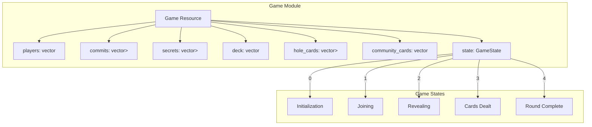
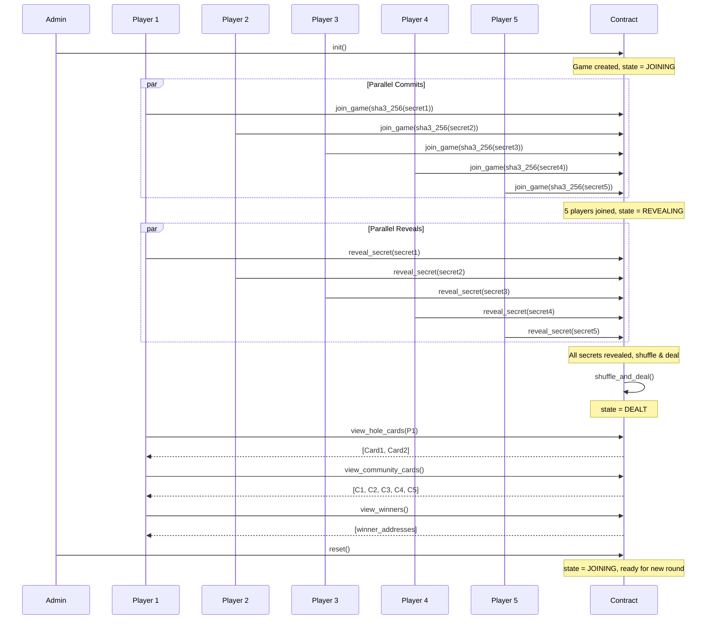
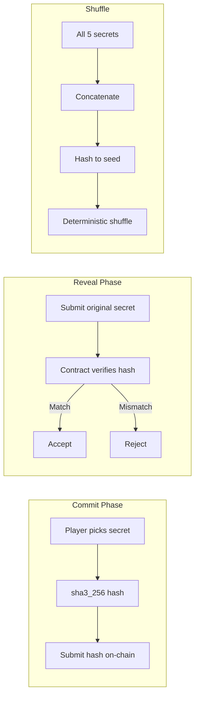

# 5‑Seat Texas Hold'em — Technical Specification

> A fully on-chain, multi-player card game demonstrating **commit-reveal randomness**, **resource-safe state management**, and **parallel execution** on Cedra.

---

## Table of Contents

1. [Overview](#overview)
2. [Architecture](#architecture)
3. [Game Flow](#game-flow)
4. [Module Design](#module-design)
5. [Data Structures](#data-structures)
6. [Public Functions](#public-functions)
7. [View Functions](#view-functions)
8. [Anti-Cheat & Security](#anti-cheat--security)
9. [Gas Optimization](#gas-optimization)
10. [Testing Strategy](#testing-strategy)
11. [CLI Commands](#cli-commands)
12. [Future Extensions](#future-extensions)
13. [References](#references)

---

## Overview

This package implements a simplified **Texas Hold'em‑style** card game using Cedra's Move VM. It demonstrates how to orchestrate multi‑party gameplay on-chain without any wagering.

### Key Features

| Feature | Description |
|---------|-------------|
| **Commit-Reveal Randomness** | Players submit hashed secrets, then reveal to seed a deterministic shuffle |
| **5-Player Limit** | Fixed player count for predictable state and simpler logic |
| **Deterministic Shuffle** | `sha3_256` hashing produces verifiable card ordering |
| **Resource-Safe Design** | Single `Game` resource with minimal storage footprint |
| **No Wagering** | Purely demonstrative—no fungible assets or betting |

### Why Cedra?

Cedra's architecture is ideal for on-chain games:

- **Block-STM Parallel Execution**: Concurrent player transactions (commits/reveals) execute in parallel
- **CedraBFT Consensus**: <1s deterministic finality for responsive gameplay
- **Linear-Type Move VM**: Resource safety prevents duplication/loss of game state
- **VRF-Backed Randomness Oracle**: Available for future integration (this example uses commit-reveal)

---

## Architecture



---

## Game Flow



### Phase Details

1. **Initialization**
   - Admin publishes the package and calls `init()` once
   - Creates a single `Game` resource under the module address
   
2. **Join Phase** (`state = JOINING`)
   - Exactly 5 players call `join_game(hashed_commit)`
   - Each commit is a 32-byte `sha3_256` digest of a secret
   - Joining closes automatically when 5 players have committed
   
3. **Reveal Phase** (`state = REVEALING`)
   - Each player calls `reveal_secret(secret)`
   - Contract verifies `sha3_256(secret) == stored_commit`
   - When all 5 secrets are revealed, triggers shuffle
   
4. **Deal Phase** (`state = DEALT`)
   - Secrets are concatenated and hashed to produce a shuffle seed
   - Deck is shuffled using repeated `sha3_256` hashing
   - First 10 cards → hole cards (2 per player)
   - Next 5 cards → community board
   
5. **Winner Determination**
   - `view_winners()` computes a simple score per player
   - Score = sum of hole card ranks + best 3 community card ranks
   - Highest score wins (ties allowed)
   
6. **Reset**
   - Admin calls `reset()` to clear all state
   - Game returns to `JOINING` state for a new round

---

## Module Design

### Package Structure

```
game-mechanics/5-seat-texas-holdem/
├── Move.toml
├── sources/
│   └── texas_holdem.move
├── tests/
│   └── texas_holdem_tests.move
└── plan.md
```

### Move.toml

```toml
[package]
name = "TexasHoldem"
version = "1.0.0"
upgrade_policy = "compatible"

[addresses]
holdemgame = "_"

[dev-addresses]
holdemgame = "0xCAFE"

[dependencies]
CedraFramework = { 
    git = "https://github.com/cedra-labs/cedra-framework.git", 
    subdir = "cedra-framework", 
    rev = "main" 
}

[dev-dependencies]
```

---

## Data Structures

### Game Resource

```move
module holdemgame::texas_holdem {
    use std::vector;
    use std::signer;
    use cedra_std::hash;
    
    /// Error codes
    const E_NOT_ADMIN: u64 = 1;
    const E_GAME_ALREADY_INITIALIZED: u64 = 2;
    const E_GAME_NOT_INITIALIZED: u64 = 3;
    const E_ALREADY_JOINED: u64 = 4;
    const E_GAME_FULL: u64 = 5;
    const E_NOT_A_PLAYER: u64 = 6;
    const E_ALREADY_REVEALED: u64 = 7;
    const E_INVALID_SECRET: u64 = 8;
    const E_WRONG_PHASE: u64 = 9;
    const E_NOT_ALL_REVEALED: u64 = 10;
    
    /// Game state constants
    const STATE_JOINING: u8 = 0;
    const STATE_REVEALING: u8 = 1;
    const STATE_DEALT: u8 = 2;
    
    /// Game configuration
    const MAX_PLAYERS: u64 = 5;
    const CARDS_PER_PLAYER: u64 = 2;
    const COMMUNITY_CARDS: u64 = 5;
    const DECK_SIZE: u64 = 52;
    
    /// The main game resource stored at the module address
    struct Game has key {
        /// Addresses of joined players
        players: vector<address>,
        /// SHA3-256 hashes of player secrets (commitments)
        commits: vector<vector<u8>>,
        /// Revealed secrets (populated during reveal phase)
        secrets: vector<vector<u8>>,
        /// The shuffled deck (52 cards, each 0-51)
        deck: vector<u8>,
        /// Hole cards for each player (2 cards each)
        hole_cards: vector<vector<u8>>,
        /// The 5 community cards
        community_cards: vector<u8>,
        /// Current game state
        state: u8,
        /// Admin address (for reset permissions)
        admin: address,
    }
}
```

### Card Representation

Cards are represented as single bytes (0-51):

| Value | Meaning |
|-------|---------|
| 0-12 | 2♣ through A♣ |
| 13-25 | 2♦ through A♦ |
| 26-38 | 2♥ through A♥ |
| 39-51 | 2♠ through A♠ |

**Rank extraction**: `rank = card % 13` (0 = 2, 12 = Ace)  
**Suit extraction**: `suit = card / 13` (0 = Clubs, 3 = Spades)

---

## Public Functions

### Admin Functions

```move
/// Initialize the game (called once by admin)
public entry fun init(admin: &signer) {
    let admin_addr = signer::address_of(admin);
    assert!(!exists<Game>(admin_addr), E_GAME_ALREADY_INITIALIZED);
    
    move_to(admin, Game {
        players: vector::empty(),
        commits: vector::empty(),
        secrets: vector::empty(),
        deck: vector::empty(),
        hole_cards: vector::empty(),
        community_cards: vector::empty(),
        state: STATE_JOINING,
        admin: admin_addr,
    });
}

/// Reset the game for a new round (admin only)
public entry fun reset(admin: &signer) acquires Game {
    let admin_addr = signer::address_of(admin);
    let game = borrow_global_mut<Game>(admin_addr);
    assert!(game.admin == admin_addr, E_NOT_ADMIN);
    
    game.players = vector::empty();
    game.commits = vector::empty();
    game.secrets = vector::empty();
    game.deck = vector::empty();
    game.hole_cards = vector::empty();
    game.community_cards = vector::empty();
    game.state = STATE_JOINING;
}
```

### Player Functions

```move
/// Join the game with a commitment hash
public entry fun join_game(
    player: &signer, 
    game_addr: address,
    hashed_commit: vector<u8>
) acquires Game {
    let player_addr = signer::address_of(player);
    let game = borrow_global_mut<Game>(game_addr);
    
    assert!(game.state == STATE_JOINING, E_WRONG_PHASE);
    assert!(vector::length(&game.players) < MAX_PLAYERS, E_GAME_FULL);
    assert!(!vector::contains(&game.players, &player_addr), E_ALREADY_JOINED);
    assert!(vector::length(&hashed_commit) == 32, E_INVALID_SECRET);
    
    vector::push_back(&mut game.players, player_addr);
    vector::push_back(&mut game.commits, hashed_commit);
    
    // Transition to reveal phase when full
    if (vector::length(&game.players) == MAX_PLAYERS) {
        game.state = STATE_REVEALING;
    };
}

/// Reveal your secret
public entry fun reveal_secret(
    player: &signer,
    game_addr: address,
    secret: vector<u8>
) acquires Game {
    let player_addr = signer::address_of(player);
    let game = borrow_global_mut<Game>(game_addr);
    
    assert!(game.state == STATE_REVEALING, E_WRONG_PHASE);
    
    // Find player index
    let (found, idx) = vector::index_of(&game.players, &player_addr);
    assert!(found, E_NOT_A_PLAYER);
    
    // Verify commitment
    let computed_hash = hash::sha3_256(secret);
    let stored_commit = vector::borrow(&game.commits, idx);
    assert!(computed_hash == *stored_commit, E_INVALID_SECRET);
    
    // Store secret (ensure not already revealed)
    if (vector::length(&game.secrets) <= idx) {
        // Extend secrets vector if needed
        while (vector::length(&game.secrets) < idx) {
            vector::push_back(&mut game.secrets, vector::empty());
        };
        vector::push_back(&mut game.secrets, secret);
    } else {
        let existing = vector::borrow(&game.secrets, idx);
        assert!(vector::is_empty(existing), E_ALREADY_REVEALED);
        *vector::borrow_mut(&mut game.secrets, idx) = secret;
    };
    
    // Check if all revealed, then shuffle and deal
    if (all_secrets_revealed(game)) {
        shuffle_and_deal(game);
        game.state = STATE_DEALT;
    };
}
```

### Internal Functions

```move
/// Check if all players have revealed their secrets
fun all_secrets_revealed(game: &Game): bool {
    let len = vector::length(&game.secrets);
    if (len != MAX_PLAYERS) { return false };
    
    let i = 0;
    while (i < len) {
        if (vector::is_empty(vector::borrow(&game.secrets, i))) {
            return false
        };
        i = i + 1;
    };
    true
}

/// Shuffle the deck and deal cards
fun shuffle_and_deal(game: &mut Game) {
    // Concatenate all secrets and hash for seed
    let seed = vector::empty<u8>();
    let i = 0;
    while (i < MAX_PLAYERS) {
        vector::append(&mut seed, *vector::borrow(&game.secrets, i));
        i = i + 1;
    };
    let seed_hash = hash::sha3_256(seed);
    
    // Initialize deck (0-51)
    let deck = vector::empty<u8>();
    let c = 0u8;
    while ((c as u64) < DECK_SIZE) {
        vector::push_back(&mut deck, c);
        c = c + 1;
    };
    
    // Fisher-Yates shuffle using hash-based randomness
    let hash_state = seed_hash;
    let n = DECK_SIZE;
    while (n > 1) {
        hash_state = hash::sha3_256(hash_state);
        let rand_byte = *vector::borrow(&hash_state, 0);
        let j = (rand_byte as u64) % n;
        n = n - 1;
        vector::swap(&mut deck, n, j);
    };
    
    game.deck = deck;
    
    // Deal hole cards (2 per player)
    let hole_cards = vector::empty<vector<u8>>();
    let card_idx = 0;
    let p = 0;
    while (p < MAX_PLAYERS) {
        let player_cards = vector::empty<u8>();
        vector::push_back(&mut player_cards, *vector::borrow(&game.deck, card_idx));
        vector::push_back(&mut player_cards, *vector::borrow(&game.deck, card_idx + 1));
        vector::push_back(&mut hole_cards, player_cards);
        card_idx = card_idx + 2;
        p = p + 1;
    };
    game.hole_cards = hole_cards;
    
    // Deal community cards (next 5)
    let community = vector::empty<u8>();
    let c = 0;
    while (c < COMMUNITY_CARDS) {
        vector::push_back(&mut community, *vector::borrow(&game.deck, card_idx));
        card_idx = card_idx + 1;
        c = c + 1;
    };
    game.community_cards = community;
}
```

---

## View Functions

```move
#[view]
/// Get a player's hole cards
public fun view_hole_cards(game_addr: address, player: address): vector<u8> acquires Game {
    let game = borrow_global<Game>(game_addr);
    assert!(game.state == STATE_DEALT, E_WRONG_PHASE);
    
    let (found, idx) = vector::index_of(&game.players, &player);
    assert!(found, E_NOT_A_PLAYER);
    
    *vector::borrow(&game.hole_cards, idx)
}

#[view]
/// Get the community cards
public fun view_community_cards(game_addr: address): vector<u8> acquires Game {
    let game = borrow_global<Game>(game_addr);
    assert!(game.state == STATE_DEALT, E_WRONG_PHASE);
    game.community_cards
}

#[view]
/// Compute winners based on simplified scoring
public fun view_winners(game_addr: address): vector<address> acquires Game {
    let game = borrow_global<Game>(game_addr);
    assert!(game.state == STATE_DEALT, E_WRONG_PHASE);
    
    let scores = vector::empty<u64>();
    let max_score = 0u64;
    
    // Compute score for each player
    let p = 0;
    while (p < MAX_PLAYERS) {
        let score = compute_score(
            vector::borrow(&game.hole_cards, p),
            &game.community_cards
        );
        vector::push_back(&mut scores, score);
        if (score > max_score) {
            max_score = score;
        };
        p = p + 1;
    };
    
    // Find all players with max score (handle ties)
    let winners = vector::empty<address>();
    let p = 0;
    while (p < MAX_PLAYERS) {
        if (*vector::borrow(&scores, p) == max_score) {
            vector::push_back(&mut winners, *vector::borrow(&game.players, p));
        };
        p = p + 1;
    };
    
    winners
}

/// Simplified scoring: sum of hole card ranks + best 3 community ranks
fun compute_score(hole: &vector<u8>, community: &vector<u8>): u64 {
    let score = 0u64;
    
    // Add hole card ranks
    let i = 0;
    while (i < vector::length(hole)) {
        let card = *vector::borrow(hole, i);
        score = score + ((card % 13) as u64);
        i = i + 1;
    };
    
    // Sort community cards by rank (descending) and take top 3
    let ranks = vector::empty<u64>();
    let i = 0;
    while (i < vector::length(community)) {
        let card = *vector::borrow(community, i);
        vector::push_back(&mut ranks, (card % 13) as u64);
        i = i + 1;
    };
    
    // Simple bubble sort descending
    let n = vector::length(&ranks);
    let i = 0;
    while (i < n) {
        let j = i + 1;
        while (j < n) {
            if (*vector::borrow(&ranks, j) > *vector::borrow(&ranks, i)) {
                vector::swap(&mut ranks, i, j);
            };
            j = j + 1;
        };
        i = i + 1;
    };
    
    // Add top 3 ranks
    let i = 0;
    while (i < 3 && i < n) {
        score = score + *vector::borrow(&ranks, i);
        i = i + 1;
    };
    
    score
}

#[view]
/// Get current game state
public fun view_game_state(game_addr: address): u8 acquires Game {
    borrow_global<Game>(game_addr).state
}

#[view]
/// Get list of players
public fun view_players(game_addr: address): vector<address> acquires Game {
    borrow_global<Game>(game_addr).players
}
```

---

## Anti-Cheat & Security

### Commit-Reveal Scheme

The commit-reveal pattern ensures **fair randomness**:



**Security Properties**:

| Property | Guarantee |
|----------|-----------|
| **Pre-image resistance** | Cannot reverse hash to discover others' secrets |
| **Binding** | Cannot change secret after committing |
| **Unpredictability** | Final seed requires all 5 secrets |
| **Verifiability** | Anyone can verify the shuffle was correct |

### Failure Modes

> [!WARNING]  
> **Liveness Issue**: If any player fails to reveal, the game cannot proceed. Consider implementing a timeout mechanism with `cedra_framework::timestamp`.

### No Wagering

This module intentionally avoids:
- Fungible asset handling
- Betting mechanics
- Prize distribution

This keeps the example focused and avoids regulated gambling mechanics.

---

## Gas Optimization

### Storage Efficiency

| Resource | Size | Notes |
|----------|------|-------|
| `Game` | ~1KB | Single resource per game |
| `players` | 5 × 32 bytes | Fixed-size vector |
| `commits` | 5 × 32 bytes | SHA3-256 digests |
| `secrets` | 5 × variable | Player-chosen secrets |
| `deck` | 52 bytes | One byte per card |
| `hole_cards` | 5 × 2 bytes | 2 cards per player |
| `community_cards` | 5 bytes | Board cards |

### Parallel Execution

Cedra's **Block-STM** engine allows concurrent execution:

- **Commits**: Multiple `join_game` calls can execute in parallel (no read-write conflicts until full)
- **Reveals**: Multiple `reveal_secret` calls can execute in parallel (each modifies different index)

### Optimization Tips

1. Use `vector::swap_remove` instead of `vector::remove` when order doesn't matter
2. Avoid unnecessary borrows—use `borrow` vs `borrow_mut` appropriately
3. Keep secrets reasonably sized (32-64 bytes recommended)

---

## Testing Strategy

### Unit Tests

```move
#[test_only]
module holdemgame::texas_holdem_tests {
    use std::signer;
    use std::vector;
    use cedra_std::hash;
    use holdemgame::texas_holdem;
    
    #[test(admin = @holdemgame)]
    fun test_init(admin: &signer) {
        texas_holdem::init(admin);
        let state = texas_holdem::view_game_state(signer::address_of(admin));
        assert!(state == 0, 0); // STATE_JOINING
    }
    
    #[test(admin = @holdemgame, p1 = @0x1, p2 = @0x2, p3 = @0x3, p4 = @0x4, p5 = @0x5)]
    fun test_full_game_flow(
        admin: &signer,
        p1: &signer,
        p2: &signer,
        p3: &signer,
        p4: &signer,
        p5: &signer
    ) {
        // Initialize
        texas_holdem::init(admin);
        let game_addr = signer::address_of(admin);
        
        // Players join with commitments
        let secrets = vector[
            b"secret1",
            b"secret2",
            b"secret3",
            b"secret4",
            b"secret5"
        ];
        
        let players = vector[p1, p2, p3, p4, p5];
        let i = 0;
        while (i < 5) {
            let secret = *vector::borrow(&secrets, i);
            let commit = hash::sha3_256(secret);
            texas_holdem::join_game(
                *vector::borrow(&players, i),
                game_addr,
                commit
            );
            i = i + 1;
        };
        
        // Verify state transitioned to REVEALING
        assert!(texas_holdem::view_game_state(game_addr) == 1, 1);
        
        // Players reveal secrets
        let i = 0;
        while (i < 5) {
            texas_holdem::reveal_secret(
                *vector::borrow(&players, i),
                game_addr,
                *vector::borrow(&secrets, i)
            );
            i = i + 1;
        };
        
        // Verify state transitioned to DEALT
        assert!(texas_holdem::view_game_state(game_addr) == 2, 2);
        
        // Verify we can view cards
        let hole = texas_holdem::view_hole_cards(game_addr, @0x1);
        assert!(vector::length(&hole) == 2, 3);
        
        let community = texas_holdem::view_community_cards(game_addr);
        assert!(vector::length(&community) == 5, 4);
        
        // Verify winners can be determined
        let winners = texas_holdem::view_winners(game_addr);
        assert!(vector::length(&winners) >= 1, 5);
    }
    
    #[test(admin = @holdemgame)]
    #[expected_failure(abort_code = 9)] // E_WRONG_PHASE
    fun test_cannot_reveal_before_join_phase(admin: &signer) {
        texas_holdem::init(admin);
        texas_holdem::reveal_secret(admin, signer::address_of(admin), b"secret");
    }
}
```

### Running Tests

```bash
cd game-mechanics/5-seat-texas-holdem
cedra move test
```

---

## CLI Commands

### 1. Initialize the Project

```bash
cd game-mechanics/5-seat-texas-holdem
cedra init --network testnet
```

### 2. Compile

```bash
cedra move compile
```

### 3. Run Tests

```bash
cedra move test
```

### 4. Publish

```bash
cedra move publish --named-addresses holdemgame=default
```

### 5. Initialize Game

```bash
cedra move run --function-id 'default::texas_holdem::init'
```

### 6. Players Join

Each player computes their commitment off-chain:
```bash
# Off-chain: sha3_256("my_secret_value") -> 0x...
cedra move run --function-id 'default::texas_holdem::join_game' \
  --args 'address:<game_addr>' 'hex:0x<32_byte_hash>'
```

### 7. Players Reveal

```bash
cedra move run --function-id 'default::texas_holdem::reveal_secret' \
  --args 'address:<game_addr>' 'hex:0x<original_secret_bytes>'
```

### 8. View Cards

```bash
# View hole cards
cedra move view --function-id 'default::texas_holdem::view_hole_cards' \
  --args 'address:<game_addr>' 'address:<player_addr>'

# View community cards
cedra move view --function-id 'default::texas_holdem::view_community_cards' \
  --args 'address:<game_addr>'

# View winners
cedra move view --function-id 'default::texas_holdem::view_winners' \
  --args 'address:<game_addr>'
```

### 9. Reset Game

```bash
cedra move run --function-id 'default::texas_holdem::reset'
```

---

## Future Extensions

### 1. Full Hand Ranking

Replace `compute_score` with a proper poker hand evaluator:

```move
/// Hand rankings (higher = better)
const HAND_HIGH_CARD: u8 = 0;
const HAND_PAIR: u8 = 1;
const HAND_TWO_PAIR: u8 = 2;
const HAND_THREE_OF_KIND: u8 = 3;
const HAND_STRAIGHT: u8 = 4;
const HAND_FLUSH: u8 = 5;
const HAND_FULL_HOUSE: u8 = 6;
const HAND_FOUR_OF_KIND: u8 = 7;
const HAND_STRAIGHT_FLUSH: u8 = 8;
const HAND_ROYAL_FLUSH: u8 = 9;

fun evaluate_hand(cards: vector<u8>): (u8, u64) {
    // Returns (hand_type, kicker_value)
    // Implementation: detect combinations, compare kickers
}
```

### 2. VRF Integration

Use Cedra's built-in randomness oracle for stronger security:

```move
use cedra_framework::randomness;

#[randomness]
entry fun secure_shuffle_and_deal(game: &mut Game) {
    // Use on-chain VRF instead of commit-reveal
    let rand_seed = randomness::u64_range(0, u64::MAX);
    // ... shuffle using rand_seed
}
```

> [!NOTE]  
> Functions using `randomness` must be marked with `#[randomness]` attribute and called as entry functions.

### 3. Betting Rounds

Add phases and integrate with Cedra's Fungible Asset standard:

```move
use cedra_framework::fungible_asset;
use cedra_framework::primary_fungible_store;

struct BettingRound has store {
    pot: FungibleStore,
    current_bet: u64,
    player_bets: vector<u64>,
    phase: u8, // PRE_FLOP, FLOP, TURN, RIVER
}
```

### 4. Timeout Mechanism

Implement reveal timeouts using the timestamp module:

```move
use cedra_framework::timestamp;

const REVEAL_TIMEOUT_SECS: u64 = 300; // 5 minutes

struct Game has key {
    // ... existing fields ...
    reveal_deadline: u64,
}

public entry fun force_reveal_timeout(game: &mut Game) {
    let now = timestamp::now_seconds();
    assert!(now > game.reveal_deadline, E_TIMEOUT_NOT_REACHED);
    // Penalize non-revealers, refund others
}
```

---

## References

- [Cedra Architecture](https://docs.cedra.network/architecture) — Block-STM, CedraBFT, VRF oracle
- [Move Package Management](https://docs.cedra.network/move-package-management) — Project structure, dependencies
- [CLI Usage](https://docs.cedra.network/cli/usage) — Init, compile, test, publish commands
- [Resource Types](https://docs.cedra.network/move/resource) — Capabilities, hot potato pattern
- [Escrow Guide](https://docs.cedra.network/guides/escrow) — Time-locked resources pattern
- [Code Examples Repository](https://github.com/cedra-labs/move-contract-examples) — Reference implementations

---

*Built for Cedra — The first community-owned blockchain built on Move*
