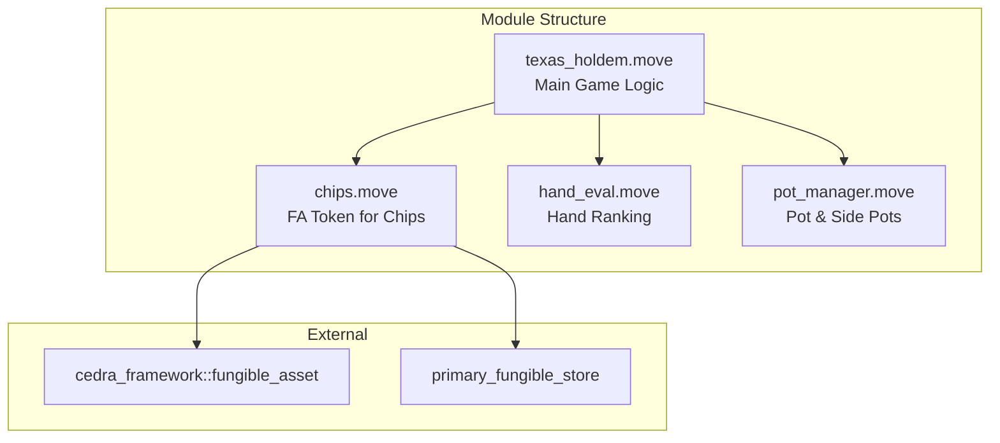
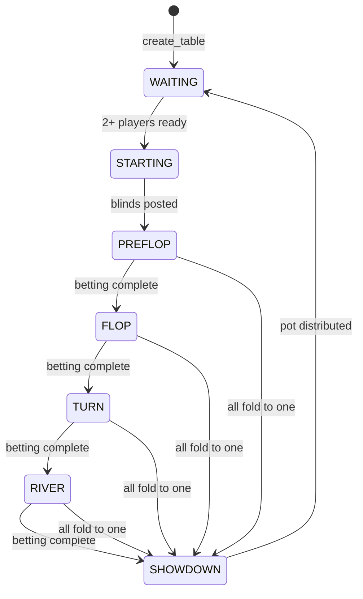

# Casino-Grade Texas Hold'em Upgrade Plan

> Upgrading from a card-dealing demo to a **fully-featured poker game** with blinds, betting rounds, hand evaluation, and pot management.

---

## Table of Contents

1. [Overview](#overview)
2. [Architecture](#architecture)
3. [Token System](#token-system)
4. [Game Structure](#game-structure)
5. [Betting Mechanics](#betting-mechanics)
6. [Hand Evaluation](#hand-evaluation)
7. [Module Design](#module-design)
8. [Data Structures](#data-structures)
9. [Function Signatures](#function-signatures)
10. [Verification Plan](#verification-plan)

---

## Overview

### Current State
- ✅ Commit-reveal card shuffling
- ✅ 5-player support
- ✅ Basic card dealing
- ✅ Simplified winner determination
- ❌ No betting/chips
- ❌ No betting rounds
- ❌ No hand rankings

### Target State
Full casino-grade Texas Hold'em with:
- Configurable blinds (small/big)
- Dealer button rotation
- 4 betting rounds (pre-flop, flop, turn, river)
- All player actions (fold, check, call, raise, all-in)
- Pot management with side pots
- Full poker hand evaluation (10 hand types)
- Automatic winner payout

---

## Architecture



---

## Token System

### Chip Token (Fungible Asset)

Players buy chips with CEDRA, play the game, and cash out.

```move
module holdemgame::chips {
    /// Chip metadata stored at module address
    struct ChipManager has key {
        mint_ref: MintRef,
        burn_ref: BurnRef,
        transfer_ref: TransferRef,
        metadata: Object<Metadata>,
        /// Price per chip in Octas (1 CEDRA = 100_000_000 Octas)
        price_per_chip: u64,
    }
    
    /// Buy chips with CEDRA
    public entry fun buy_chips(player: &signer, amount: u64);
    
    /// Cash out chips for CEDRA
    public entry fun cash_out(player: &signer, chip_amount: u64);
}
```

**Chip Economics:**
- 1 CEDRA = 1000 chips (configurable)
- Min buy-in: 100 chips (0.1 CEDRA)
- Max buy-in: 10,000 chips (10 CEDRA)

---

## Game Structure

### Game States



### Game Lifecycle

| Phase | Description |
|-------|-------------|
| **WAITING** | Table open, players can join/leave, buy more chips |
| **STARTING** | Dealer button moves, blinds posted, cards dealt |
| **PREFLOP** | 2 hole cards dealt, first betting round (starts left of BB) |
| **FLOP** | 3 community cards, second betting round |
| **TURN** | 4th community card, third betting round |
| **RIVER** | 5th community card, final betting round |
| **SHOWDOWN** | Hands revealed, pot distributed |

### Dealer & Blinds

```
Seat 0    Seat 1    Seat 2    Seat 3    Seat 4
  D         SB        BB        UTG       UTG+1
  
Hand 2:
Seat 0    Seat 1    Seat 2    Seat 3    Seat 4
          D         SB        BB        UTG
```

- **Dealer (D)**: Rotates clockwise each hand
- **Small Blind (SB)**: Left of dealer, posts half blind
- **Big Blind (BB)**: Left of SB, posts full blind
- **Under the Gun (UTG)**: First to act pre-flop

---

## Betting Mechanics

### Player Actions

| Action | When Available | Effect |
|--------|----------------|--------|
| **Fold** | Any turn | Exit hand, forfeit chips |
| **Check** | No bet to call | Pass action, stay in hand |
| **Call** | Bet to match | Match current bet |
| **Raise** | After call amount | Increase bet (min 2x current) |
| **All-In** | Any turn | Bet all remaining chips |

### Betting Rules

```move
module holdemgame::betting {
    const MIN_RAISE_MULTIPLIER: u64 = 2;  // Raise must be 2x previous raise
    const MAX_RAISES_PER_ROUND: u64 = 4;   // Cap to prevent infinite raises
    
    struct BettingRound has store {
        pot: u64,
        current_bet: u64,
        min_raise: u64,
        raises_this_round: u64,
        player_bets: vector<u64>,      // Bet amounts per player this round
        player_acted: vector<bool>,     // Has player acted this round
        last_raiser: Option<u64>,       // Index of last raiser
    }
}
```

### Side Pot Handling

When a player goes all-in with less than the current bet:

```
Example:
- Player A: 1000 chips, bets 1000 (all-in)
- Player B: 2000 chips, raises to 2000
- Player C: 3000 chips, calls 2000

Main Pot: 3000 (1000 × 3) - A, B, C eligible
Side Pot: 2000 (1000 × 2) - B, C eligible
```

---

## Hand Evaluation

### Hand Rankings (Highest to Lowest)

| Rank | Hand | Example |
|------|------|---------|
| 9 | **Royal Flush** | A♠ K♠ Q♠ J♠ 10♠ |
| 8 | **Straight Flush** | 9♥ 8♥ 7♥ 6♥ 5♥ |
| 7 | **Four of a Kind** | K♠ K♥ K♦ K♣ 2♠ |
| 6 | **Full House** | Q♠ Q♥ Q♦ 8♣ 8♠ |
| 5 | **Flush** | A♦ J♦ 8♦ 6♦ 2♦ |
| 4 | **Straight** | 10♠ 9♥ 8♦ 7♣ 6♠ |
| 3 | **Three of a Kind** | 7♠ 7♥ 7♦ K♣ 2♠ |
| 2 | **Two Pair** | J♠ J♥ 4♦ 4♣ A♠ |
| 1 | **One Pair** | 9♠ 9♥ A♦ K♣ 7♠ |
| 0 | **High Card** | A♠ Q♥ 9♦ 6♣ 2♠ |

### Hand Evaluation Algorithm

```move
module holdemgame::hand_eval {
    /// Evaluate best 5-card hand from 7 cards (2 hole + 5 community)
    /// Returns (hand_type: u8, tiebreaker: u64)
    /// tiebreaker encodes kicker values for comparing same hand types
    public fun evaluate_hand(cards: vector<u8>): (u8, u64);
    
    /// Compare two evaluated hands
    /// Returns: 1 if hand1 wins, 2 if hand2 wins, 0 if tie
    public fun compare_hands(
        type1: u8, tb1: u64,
        type2: u8, tb2: u64
    ): u8;
}
```

**Tiebreaker Encoding:**
```
For a pair of Kings with A-Q-J kickers:
tiebreaker = (11 << 32) | (12 << 24) | (11 << 16) | (10 << 8) | 0
           = King_rank | Ace_kicker | Queen_kicker | Jack_kicker | ...
```

---

## Module Design

### File Structure

```
game-mechanics/5-seat-texas-holdem/
├── Move.toml
├── sources/
│   ├── texas_holdem.move      # Main game orchestration
│   ├── chips.move             # Fungible asset token
│   ├── hand_eval.move         # Hand ranking logic
│   ├── pot_manager.move       # Pot and side pot logic
│   └── table_config.move      # Table settings (blinds, limits)
├── tests/
│   ├── game_flow_tests.move
│   ├── betting_tests.move
│   ├── hand_eval_tests.move
│   └── pot_manager_tests.move
├── plan.md
└── upgrade.plan.md
```

---

## Data Structures

### Table

```move
struct Table has key {
    /// Table configuration
    config: TableConfig,
    /// Current game state
    game: Option<Game>,
    /// Player seats (None = empty seat)
    seats: vector<Option<PlayerSeat>>,
    /// Dealer button position (0-4)
    dealer_button: u64,
    /// Total chips in play at this table
    chips_in_play: u64,
}

struct TableConfig has store, copy {
    /// Small blind amount in chips
    small_blind: u64,
    /// Big blind amount in chips
    big_blind: u64,
    /// Minimum buy-in
    min_buy_in: u64,
    /// Maximum buy-in
    max_buy_in: u64,
    /// Table admin (can adjust settings)
    admin: address,
}

struct PlayerSeat has store {
    player: address,
    chip_count: u64,
    is_sitting_out: bool,
}
```

### Active Game

```move
struct Game has store {
    /// Current phase
    phase: u8,
    /// Hole cards per player (encrypted until showdown)
    hole_cards: vector<vector<u8>>,
    /// Community cards dealt so far
    community_cards: vector<u8>,
    /// Shuffled deck
    deck: vector<u8>,
    /// Card index (next card to deal)
    deck_index: u64,
    /// Player statuses (in hand, folded, all-in)
    player_status: vector<u8>,
    /// Current betting round
    betting: BettingRound,
    /// All pots (main + side pots)
    pots: vector<Pot>,
    /// Index of player whose turn it is
    action_on: u64,
    /// Timestamp when action started (for timeouts)
    action_deadline: u64,
    /// Commit-reveal data
    commits: vector<vector<u8>>,
    secrets: vector<vector<u8>>,
}

struct Pot has store, drop {
    amount: u64,
    /// Eligible player indices
    eligible: vector<u64>,
}
```

### Player Status

```move
const STATUS_WAITING: u8 = 0;   // Not in current hand
const STATUS_ACTIVE: u8 = 1;    // In hand, can act
const STATUS_FOLDED: u8 = 2;    // Folded
const STATUS_ALL_IN: u8 = 3;    // All-in, can't act
```

---

## Function Signatures

### Table Management

```move
/// Create a new poker table
public entry fun create_table(
    admin: &signer,
    small_blind: u64,
    big_blind: u64,
    min_buy_in: u64,
    max_buy_in: u64
);

/// Join table with chip buy-in
public entry fun join_table(
    player: &signer,
    table_addr: address,
    buy_in_chips: u64
);

/// Leave table (cash out chips)
public entry fun leave_table(
    player: &signer,
    table_addr: address
);

/// Add more chips (between hands only)
public entry fun rebuy(
    player: &signer,
    table_addr: address,
    amount: u64
);
```

### Game Flow

```move
/// Start a new hand (auto-called when 2+ players ready)
public entry fun start_hand(table_addr: address);

/// Submit commit hash (for card shuffle seed)
public entry fun submit_commit(
    player: &signer,
    table_addr: address,
    commit_hash: vector<u8>
);

/// Reveal secret (triggers deal when all revealed)
public entry fun reveal_secret(
    player: &signer,
    table_addr: address,
    secret: vector<u8>
);
```

### Player Actions

```move
/// Fold hand
public entry fun fold(player: &signer, table_addr: address);

/// Check (when no bet to call)
public entry fun check(player: &signer, table_addr: address);

/// Call current bet
public entry fun call(player: &signer, table_addr: address);

/// Raise to a specific amount
public entry fun raise_to(
    player: &signer,
    table_addr: address,
    amount: u64
);

/// Go all-in
public entry fun all_in(player: &signer, table_addr: address);
```

### View Functions

```move
#[view]
public fun get_table_state(table_addr: address): (u8, u64, u64, vector<u64>);

#[view]
public fun get_my_hole_cards(table_addr: address, player: address): vector<u8>;

#[view]
public fun get_community_cards(table_addr: address): vector<u8>;

#[view]
public fun get_pot_sizes(table_addr: address): vector<u64>;

#[view]
public fun get_current_bet(table_addr: address): u64;

#[view]
public fun get_action_on(table_addr: address): address;
```

---

## Verification Plan

### Unit Tests

| Module | Tests |
|--------|-------|
| `chips.move` | Buy, cash out, transfer, edge cases |
| `hand_eval.move` | All 10 hand types, tiebreakers, edge cases |
| `pot_manager.move` | Side pots, multi-way all-in, distribution |
| `texas_holdem.move` | Full game flows, player actions, timeouts |

### Integration Tests

1. **Full 5-player game** with betting through all rounds
2. **All-in scenario** with side pot creation
3. **Fold scenario** where all but one player folds
4. **Tie scenario** with pot splitting
5. **Timeout scenario** where player auto-folds

### Devnet Testing

1. Deploy all modules
2. Create table with 10/20 blinds
3. 5 players buy-in
4. Play complete hand
5. Verify pot distribution

---

## Implementation Order

1. **Phase 1: Chip System** (~100 LOC)
   - `chips.move` - FA token with buy/cashout

2. **Phase 2: Hand Evaluation** (~300 LOC)
   - `hand_eval.move` - Full poker hand ranking

3. **Phase 3: Pot Management** (~200 LOC)
   - `pot_manager.move` - Main pot + side pots

4. **Phase 4: Game Core** (~500 LOC)
   - Refactor `texas_holdem.move` with betting rounds
   - `table_config.move` - Settings

5. **Phase 5: Testing** (~400 LOC)
   - Comprehensive test coverage

---

## Open Questions for User Review

> [!IMPORTANT]
> **Please confirm these design decisions:**

1. **Chip Token**: Should chips be a custom FA, or use CEDRA directly for bets?
2. **Timeouts**: What timeout duration for player actions? (suggested: 60 seconds)
3. **Table Limits**: Should we support No-Limit, Pot-Limit, or Fixed-Limit?
4. **Max Tables**: Can one contract support multiple tables?
5. **Rake**: Should the house take a percentage (for protocol revenue)?
6. **Sit-Out**: Allow players to sit out hands without leaving table?

---

*This upgrade transforms the demo into a production-ready poker contract.*
