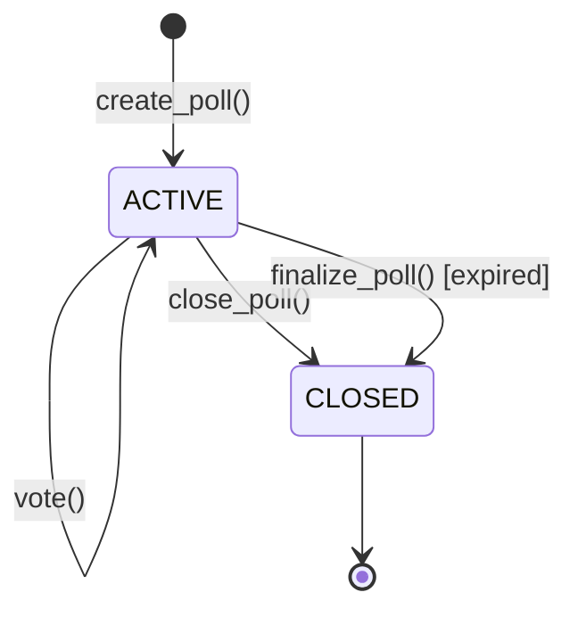

# Cedra Voting System - Yes/No Poll Smart Contract

A production-ready decentralized voting system for creating and managing yes/no polls on the Cedra blockchain with transparent, immutable vote recording.

## 📋 Table of Contents

- [Overview](#overview)
- [Features](#features)
- [Quick Start](#quick-start)
- [How It Works](#how-it-works)
- [Contract API Documentation](#contract-api-documentation)
- [Client Library Documentation](#client-library-documentation)
- [Usage Examples](#usage-examples)
- [Project Structure](#project-structure)
- [Development Guide](#development-guide)
- [Testing](#testing)
- [Architecture](#architecture)
- [Security Features](#security-features)
- [Use Cases](#use-cases)
- [Error Codes](#error-codes)
- [Contributing](#contributing)

---

## Overview

The Voting System enables creation of decentralized yes/no polls with the following capabilities:

- **🗳️ Democratic Voting** - One vote per address per poll
- **⏰ Time-Based Expiration** - Polls automatically expire after deadline
- **📊 Transparent Results** - Real-time vote counting and result tracking
- **🔒 Immutable Records** - Votes cannot be changed once cast
- **📝 Multi-Poll Support** - Create and manage multiple independent polls
- **🚫 Double-Vote Prevention** - Built-in safeguards against vote manipulation

---

## Features

### Core Functionality

✅ **Poll Creation** - Anyone can create polls with custom questions and deadlines  
✅ **Yes/No Voting** - Simple binary voting mechanism  
✅ **Vote Tracking** - Individual voter records with timestamps  
✅ **Auto-Expiration** - Polls automatically close after deadline  
✅ **Manual Closure** - Poll creators can close polls early  
✅ **Result Calculation** - Real-time winner determination  
✅ **Multiple Polls** - Each account can manage unlimited polls  
✅ **Poll Deletion** - Remove polls with no votes  

### Security Features

🔒 **One Vote Per Address** - Prevents duplicate voting  
🔒 **State Validation** - Only active polls accept votes  
🔒 **Access Control** - Only creators can close their polls  
🔒 **Deadline Enforcement** - No voting after expiration  
🔒 **Immutable Votes** - Votes cannot be changed once cast  

---

## Quick Start

### Prerequisites

- **Node.js** 18+ ([Download](https://nodejs.org/))
- **Cedra CLI** ([Installation Guide](https://docs.cedra.dev/cli))
- **TypeScript** 4.5+
- **Basic blockchain knowledge**

### 1. Deploy Contract

```bash
# Navigate to contract directory
cd contract

# Initialize Cedra account
cedra init

# Fund account from faucet (testnet only)
cedra account fund-with-faucet

# Compile the contract
cedra move compile --named-addresses voting=default

# Deploy to blockchain
cedra move publish --named-addresses voting=default

# Copy the deployed module address from output
# Example output: "0x604e072b2c6c7856ba66729783794aeb7a9bd97a8ec456a5bd0866abbeba45f7"
```

### 2. Setup Client

```bash
# Navigate to client directory
cd ../client

# Install dependencies
npm install

# Update MODULE_ADDRESS in voting-client.ts
# Replace "_" with your deployed contract address
const MODULE_ADDRESS = "0x604e072b2c6c7856ba66729783794aeb...";
```

### 3. Run Tests

```bash
# Run all tests
npm start

# Run individual tests
npm start -- --test1  # Voting lifecycle
npm start -- --test2  # Multiple polls
npm start -- --test3  # Edge cases
```

---

## How It Works

### Basic Flow

```
1. Creator → Create Poll (question + deadline)
2. Voters → Cast Votes (yes/no)
3. System → Track & Count Votes
4. Creator/System → Close Poll
5. Anyone → View Results
```

### Poll Lifecycle



---

## Contract API Documentation

### Entry Functions

All entry functions that modify blockchain state. These functions require gas fees.

---

#### `create_poll`

**Purpose:** Creates a new yes/no poll.

**Signature:**
```move
public entry fun create_poll(
    creator: &signer,
    question: vector<u8>,    // UTF-8 encoded question
    deadline: u64,           // Unix timestamp (seconds)
)
```

**Parameters:**
- `creator` - The signer creating the poll
- `question` - Poll question as byte vector (use UTF-8 encoding)
- `deadline` - Unix timestamp when poll expires (must be in future)

**Requirements:**
- Question cannot be empty
- Deadline must be after current time
- Creator must have account on blockchain

**Emits:** Poll created with auto-incremented ID

**Example:**
```typescript
const question = "Should we implement the new feature?";
const deadline = Math.floor(Date.now() / 1000) + 3600; // 1 hour from now
await client.createPoll(creator, question, deadline);
```

---

#### `vote`

**Purpose:** Cast a yes or no vote on an active poll.

**Signature:**
```move
public entry fun vote(
    voter: &signer,
    poll_creator: address,   // Address of poll creator
    poll_id: u64,            // ID of the poll
    vote_yes: bool,          // true = YES, false = NO
)
```

**Parameters:**
- `voter` - The signer casting the vote
- `poll_creator` - Address of the account that created the poll
- `poll_id` - Unique identifier of the poll
- `vote_yes` - Vote choice (true for YES, false for NO)

**Requirements:**
- Poll must exist and be active
- Poll must not be expired
- Voter must not have already voted on this poll
- Voter must have account on blockchain

**Effects:**
- Records voter address and vote choice
- Increments yes_votes or no_votes counter
- Adds voter to poll's voter list with timestamp

**Example:**
```typescript
// Vote YES
await client.vote(voter, pollCreator.address, 0, true);

// Vote NO
await client.vote(voter, pollCreator.address, 0, false);
```

---

#### `close_poll`

**Purpose:** Manually close a poll before its deadline (creator only).

**Signature:**
```move
public entry fun close_poll(
    creator: &signer,
    poll_id: u64,
)
```

**Parameters:**
- `creator` - The signer who created the poll
- `poll_id` - ID of the poll to close

**Requirements:**
- Poll must exist
- Caller must be the poll creator
- Poll must be in ACTIVE state

**Effects:**
- Changes poll status to CLOSED
- No more votes can be cast
- Results are finalized

**Example:**
```typescript
await client.closePoll(creator, 0);
```

---

#### `finalize_poll`

**Purpose:** Close an expired poll (can be called by anyone).

**Signature:**
```move
public entry fun finalize_poll(
    poll_creator: address,
    poll_id: u64,
)
```

**Parameters:**
- `poll_creator` - Address of the account that created the poll
- `poll_id` - ID of the poll to finalize

**Requirements:**
- Poll must exist
- Poll must be in ACTIVE state
- Current time must be >= poll deadline

**Effects:**
- Changes poll status to CLOSED
- Results are finalized
- Anyone can call this function

**Example:**
```typescript
await client.finalizePoll(anyone, pollCreator.address, 0);
```

**Use Case:** Allows community members to close expired polls, removing dependency on poll creator

---

#### `delete_poll`

**Purpose:** Delete a poll with no votes (creator only).

**Signature:**
```move
public entry fun delete_poll(
    creator: &signer,
    poll_id: u64,
)
```

**Parameters:**
- `creator` - The signer who created the poll
- `poll_id` - ID of the poll to delete

**Requirements:**
- Poll must exist
- Caller must be the poll creator
- Poll must have zero votes
- Used to clean up unused polls

**Effects:**
- Removes poll from registry
- Frees up storage space
- Poll ID cannot be reused

**Example:**
```typescript
await client.deletePoll(creator, 0);
```

---

### View Functions

Read-only functions that query blockchain state without gas costs.

---

#### `get_poll_info`

**Purpose:** Get complete information about a specific poll.

**Signature:**
```move
#[view]
public fun get_poll_info(creator: address, poll_id: u64): (
    u64,        // poll_id
    address,    // creator
    vector<u8>, // question (UTF-8 bytes)
    u64,        // yes_votes
    u64,        // no_votes
    u64,        // deadline (Unix timestamp)
    u8,         // status (0=ACTIVE, 1=CLOSED)
    u64,        // total_voters
    u64,        // created_at (Unix timestamp)
)
```

**Returns:** Tuple with 9 elements containing all poll data

**Example:**
```typescript
const info = await client.getPollInfo(creator.address, 0);
console.log(`Question: ${info.question}`);
console.log(`YES: ${info.yes_votes}, NO: ${info.no_votes}`);
```

---

#### `get_poll_ids`

**Purpose:** Get all poll IDs created by an address.

**Signature:**
```move
#[view]
public fun get_poll_ids(creator: address): vector<u64>
```

**Returns:** Array of poll IDs (empty if no polls)

**Example:**
```typescript
const pollIds = await client.getPollIds(creator.address);
// [0, 1, 2]
```

---

#### `has_user_voted`

**Purpose:** Check if a specific address has voted on a poll.

**Signature:**
```move
#[view]
public fun has_user_voted(
    creator: address,
    poll_id: u64,
    voter: address
): bool
```

**Returns:** `true` if voter has cast a vote, `false` otherwise

**Example:**
```typescript
const hasVoted = await client.hasUserVoted(
    creator.address,
    0,
    voter.address
);
```

---

#### `get_vote_counts`

**Purpose:** Get vote tallies for a poll.

**Signature:**
```move
#[view]
public fun get_vote_counts(
    creator: address,
    poll_id: u64
): (u64, u64, u64)  // (yes_votes, no_votes, total_voters)
```

**Returns:** Tuple of (YES count, NO count, Total voters)

**Example:**
```typescript
const counts = await client.getVoteCounts(creator.address, 0);
console.log(`YES: ${counts.yesVotes}`);
console.log(`NO: ${counts.noVotes}`);
console.log(`Total: ${counts.totalVoters}`);
```

---

#### `is_poll_active`

**Purpose:** Check if poll is accepting votes.

**Signature:**
```move
#[view]
public fun is_poll_active(creator: address, poll_id: u64): bool
```

**Returns:** `true` if poll is active and not expired, `false` otherwise

**Example:**
```typescript
const active = await client.isPollActive(creator.address, 0);
if (active) {
    console.log("Poll is open for voting");
}
```

---

#### `get_poll_result`

**Purpose:** Get poll winner and vote counts.

**Signature:**
```move
#[view]
public fun get_poll_result(
    creator: address,
    poll_id: u64
): (bool, u64, u64)  // (yes_winning, yes_votes, no_votes)
```

**Returns:** Tuple of (YES is winning, YES count, NO count)

**Note:** In case of tie, `yes_winning` is `false`

**Example:**
```typescript
const result = await client.getPollResult(creator.address, 0);
if (result.yesWinning) {
    console.log("YES wins!");
} else {
    console.log("NO wins or tie!");
}
```

---

#### `poll_exists`

**Purpose:** Check if a poll exists.

**Signature:**
```move
#[view]
public fun poll_exists(creator: address, poll_id: u64): bool
```

**Returns:** `true` if poll exists, `false` otherwise

---

#### `get_total_polls`

**Purpose:** Get total number of polls created by an address.

**Signature:**
```move
#[view]
public fun get_total_polls(creator: address): u64
```

**Returns:** Number of polls (0 if none)

---

### Status Constants

```move
const STATUS_ACTIVE: u8 = 0;   // Poll is open for voting
const STATUS_CLOSED: u8 = 1;   // Poll is closed (finalized)
```

---

## Client Library Documentation

### Installation

```bash
npm install @cedra-labs/ts-sdk
```

### VotingClient Class

Complete TypeScript client for interacting with the voting contract.

#### Constructor

```typescript
constructor(
    network: Network = Network.TESTNET,
    moduleAddress: string = MODULE_ADDRESS
)
```

**Parameters:**
- `network` - Cedra network (TESTNET or MAINNET)
- `moduleAddress` - Deployed contract address

**Example:**
```typescript
import { VotingClient } from './voting-client';
import { Network } from '@cedra-labs/ts-sdk';

// Testnet (default)
const client = new VotingClient();

// Mainnet
const client = new VotingClient(Network.MAINNET, "0x...");
```

---

#### Client Methods

All client methods are fully documented with JSDoc comments in the source code.

**Account Management:**
```typescript
// Fund account from faucet (testnet only)
await client.fundAccount(account.accountAddress, amount);
```

**Poll Operations:**
```typescript
// Create poll
await client.createPoll(creator, question, deadlineSeconds);

// Cast vote
await client.vote(voter, pollCreator, pollId, voteYes);

// Close poll
await client.closePoll(creator, pollId);

// Finalize expired poll
await client.finalizePoll(caller, pollCreator, pollId);

// Delete poll
await client.deletePoll(creator, pollId);
```

**Query Operations:**
```typescript
// Get poll info
const info = await client.getPollInfo(creator, pollId);

// Get all poll IDs
const ids = await client.getPollIds(creator);

// Check if voted
const hasVoted = await client.hasUserVoted(creator, pollId, voter);

// Get vote counts
const counts = await client.getVoteCounts(creator, pollId);

// Check if active
const active = await client.isPollActive(creator, pollId);

// Get result
const result = await client.getPollResult(creator, pollId);

// Check existence
const exists = await client.pollExists(creator, pollId);

// Get total polls
const total = await client.getTotalPolls(creator);
```

---

## Usage Examples

### Example 1: Simple Community Vote

```typescript
import { VotingClient } from './voting-client';
import { Account } from '@cedra-labs/ts-sdk';

const client = new VotingClient();

// Setup accounts
const creator = Account.generate();
const voter1 = Account.generate();
const voter2 = Account.generate();

// Fund accounts
await client.fundAccount(creator.accountAddress);
await client.fundAccount(voter1.accountAddress);
await client.fundAccount(voter2.accountAddress);

// Create poll (expires in 1 hour)
const question = "Should we upgrade to version 2.0?";
const deadline = Math.floor(Date.now() / 1000) + 3600;
await client.createPoll(creator, question, deadline);

// Cast votes
await client.vote(voter1, creator.accountAddress, 0, true);  // YES
await client.vote(voter2, creator.accountAddress, 0, false); // NO

// Check results
const result = await client.getPollResult(creator.accountAddress, 0);
console.log(`Winner: ${result.yesWinning ? 'YES' : 'NO'}`);
console.log(`Votes: YES=${result.yesVotes}, NO=${result.noVotes}`);

// Close poll
await client.closePoll(creator, 0);
```

**Expected Output:**
```
✅ Poll created successfully!
✅ Vote cast successfully! (YES)
✅ Vote cast successfully! (NO)
Winner: YES
Votes: YES=1, NO=1
✅ Poll closed successfully!
```

---

### Example 2: DAO Governance Vote

```typescript
// Scenario: DAO voting on treasury spending

const client = new VotingClient();

// Setup DAO members
const daoAdmin = Account.generate();
const member1 = Account.generate();
const member2 = Account.generate();
const member3 = Account.generate();
const member4 = Account.generate();
const member5 = Account.generate();

// Fund accounts
await Promise.all([
    client.fundAccount(daoAdmin.accountAddress),
    client.fundAccount(member1.accountAddress),
    client.fundAccount(member2.accountAddress),
    client.fundAccount(member3.accountAddress),
    client.fundAccount(member4.accountAddress),
    client.fundAccount(member5.accountAddress),
]);

// Create governance proposal
const proposal = "Proposal #5: Allocate 100,000 CEDRA for marketing campaign?";
const votingPeriod = 7 * 24 * 3600; // 7 days
const deadline = Math.floor(Date.now() / 1000) + votingPeriod;

await client.createPoll(daoAdmin, proposal, deadline);
console.log("📋 Governance proposal created");

// DAO members vote
await client.vote(member1, daoAdmin.accountAddress, 0, true);  // FOR
await client.vote(member2, daoAdmin.accountAddress, 0, true);  // FOR
await client.vote(member3, daoAdmin.accountAddress, 0, true);  // FOR
await client.vote(member4, daoAdmin.accountAddress, 0, false); // AGAINST
await client.vote(member5, daoAdmin.accountAddress, 0, false); // AGAINST

// Get voting results
const counts = await client.getVoteCounts(daoAdmin.accountAddress, 0);
const result = await client.getPollResult(daoAdmin.accountAddress, 0);

console.log("\n📊 Voting Results:");
console.log(`FOR: ${counts.yesVotes} votes`);
console.log(`AGAINST: ${counts.noVotes} votes`);
console.log(`Total Voters: ${counts.totalVoters}`);
console.log(`Status: ${result.yesWinning ? '✅ PASSED' : '❌ REJECTED'}`);

// Finalize proposal
await client.closePoll(daoAdmin, 0);
console.log("\n🔒 Proposal finalized");
```

**Expected Output:**
```
📋 Governance proposal created
✅ Vote cast successfully! (YES)
✅ Vote cast successfully! (YES)
✅ Vote cast successfully! (YES)
✅ Vote cast successfully! (NO)
✅ Vote cast successfully! (NO)

📊 Voting Results:
FOR: 3 votes
AGAINST: 2 votes
Total Voters: 5
Status: ✅ PASSED

🔒 Proposal finalized
```

---

### Example 3: Multiple Polls Management

```typescript
// Scenario: Product feedback with multiple polls

const client = new VotingClient();

const productManager = Account.generate();
await client.fundAccount(productManager.accountAddress);

// Create multiple feedback polls
const deadline = Math.floor(Date.now() / 1000) + 86400; // 24 hours

await client.createPoll(
    productManager,
    "Do you like the new UI design?",
    deadline
);

await client.createPoll(
    productManager,
    "Should we add dark mode?",
    deadline
);

await client.createPoll(
    productManager,
    "Is the app performance satisfactory?",
    deadline
);

// Get all poll IDs
const pollIds = await client.getPollIds(productManager.accountAddress);
console.log(`Created ${pollIds.length} feedback polls`);

// Display all polls
for (const pollId of pollIds) {
    const info = await client.getPollInfo(productManager.accountAddress, pollId);
    console.log(`\nPoll #${pollId}: ${info.question}`);
    console.log(`Status: ${info.status === 0 ? 'Open' : 'Closed'}`);
    console.log(`Responses: ${info.total_voters}`);
}

// Users vote on polls
const user = Account.generate();
await client.fundAccount(user.accountAddress);

await client.vote(user, productManager.accountAddress, 0, true);
await client.vote(user, productManager.accountAddress, 1, true);
await client.vote(user, productManager.accountAddress, 2, false);

// Check which polls user participated in
for (const pollId of pollIds) {
    const hasVoted = await client.hasUserVoted(
        productManager.accountAddress,
        pollId,
        user.accountAddress
    );
    console.log(`Poll #${pollId}: ${hasVoted ? '✅ Voted' : '⬜ Not voted'}`);
}
```

**Expected Output:**
```
Created 3 feedback polls

Poll #0: Do you like the new UI design?
Status: Open
Responses: 0

Poll #1: Should we add dark mode?
Status: Open
Responses: 0

Poll #2: Is the app performance satisfactory?
Status: Open
Responses: 0

✅ Vote cast successfully! (YES)
✅ Vote cast successfully! (YES)
✅ Vote cast successfully! (NO)

Poll #0: ✅ Voted
Poll #1: ✅ Voted
Poll #2: ✅ Voted
```

---

### Example 4: Event-Based Poll

```typescript
// Scenario: Conference session voting

const client = new VotingClient();

const eventOrganizer = Account.generate();
await client.fundAccount(eventOrganizer.accountAddress);

// Create poll that expires during conference
const sessionTime = Math.floor(Date.now() / 1000) + 3600; // 1 hour
await client.createPoll(
    eventOrganizer,
    "Was this session valuable?",
    sessionTime
);

// Attendees vote
const attendees = [
    Account.generate(),
    Account.generate(),
    Account.generate(),
    Account.generate(),
];

for (const attendee of attendees) {
    await client.fundAccount(attendee.accountAddress);
}

// Simulate voting
await client.vote(attendees[0], eventOrganizer.accountAddress, 0, true);
await client.vote(attendees[1], eventOrganizer.accountAddress, 0, true);
await client.vote(attendees[2], eventOrganizer.accountAddress, 0, true);
await client.vote(attendees[3], eventOrganizer.accountAddress, 0, false);

// Check real-time results
const isActive = await client.isPollActive(eventOrganizer.accountAddress, 0);
const counts = await client.getVoteCounts(eventOrganizer.accountAddress, 0);

console.log(`\n📊 Live Results (Poll ${isActive ? 'Active' : 'Closed'}):`);
console.log(`👍 Positive: ${counts.yesVotes}`);
console.log(`👎 Negative: ${counts.noVotes}`);
console.log(`📈 Satisfaction Rate: ${(counts.yesVotes / counts.totalVoters * 100).toFixed(1)}%`);

// Auto-finalize after deadline (simulate time passing)
// In production, anyone can call this after deadline
// await client.finalizePoll(anyone, eventOrganizer.accountAddress, 0);
```

---

## Project Structure

```
voting/
├── contract/
│   ├── sources/
│   │   └── voting.move                # Main voting contract
│   │                                  # - PollData struct (stores poll info)
│   │                                  # - PollRegistry (manages multiple polls)
│   │                                  # - Entry functions (create, vote, close)
│   │                                  # - View functions (queries)
│   ├── tests/
│   │   └── voting.move                # Comprehensive test suite
│   │                                  # - 21 unit tests
│   │                                  # - Creation, voting, management tests
│   │                                  # - Edge case validation
│   └── Move.toml                     # Move package configuration
│
├── client/
│   ├── src/
│   │   └── index.ts                  # TypeScript client library
│   │                                  # - VotingClient class
│   │                                  # - All contract interactions
│   │                                  # - 3 comprehensive integration tests
│   ├── package.json                  # Node.js dependencies
│   ├── tsconfig.json                 # TypeScript configuration
│   └── .gitignore
│
└── README.md                        
```

---

## Development Guide

### Setting Up Development Environment

#### 1. Install Prerequisites

```bash
# Install Node.js (if not installed)
# Download from https://nodejs.org/

# Verify installation
node --version  # Should be 18+
npm --version

# Install Cedra CLI

# Verify Cedra installation
cedra --version
```

#### 2. Clone and Setup

```bash
# Clone repository
git clone <your-repo-url>
cd voting

# Setup contract
cd contract
cedra init
cedra account fund-with-faucet

# Setup client
cd ../client
npm install
```

#### 3. Development Workflow

```bash
# 1. Make changes to contract
cd contract
vim sources/voting.move

# 2. Compile and test
cedra move compile --named-addresses voting=default
cedra move test --named-addresses voting=default

# 3. Deploy to testnet
cedra move publish --named-addresses voting=default

# 4. Test client
npm start
```

---

## Testing

### Move Unit Tests

The contract includes **25+ comprehensive unit tests** covering all functionality.

#### Test Categories

**✅ Creation Tests (5 tests)**
**✅ Voting Tests (7 tests)**
**✅ Poll Management Tests (6 tests)**
**✅ View Functions Tests (4 tests)**
**✅ Edge Cases & Lifecycle Tests (3 tests)**

#### Running Move Tests

```bash
cd contract

# Run all tests
cedra move test --named-addresses voting=default

```

**Expected Output:**
```
Running Move unit tests
[ PASS    ] 0xVOTING::poll_tests::test_create_poll_success
[ PASS    ] 0xVOTING::poll_tests::test_vote_yes_success
[ PASS    ] 0xVOTING::poll_tests::test_multiple_voters
...
Test result: OK. Total tests: 21; passed: 21; failed: 0
```

---

### TypeScript Integration Tests

Three major end-to-end tests covering real-world scenarios.

#### Test 1: Complete Voting Lifecycle

**Purpose:** Tests full voting process with multiple participants

**Flow:**
1. Create poll with 1-hour deadline
2. 3 voters cast votes (2 YES, 1 NO)
3. Verify vote counts and individual voter status
4. Check poll results (YES wins)
5. Close poll and verify closure

**Validates:**
- Poll creation ✓
- Multiple voters ✓
- Vote counting ✓
- Result calculation ✓
- Poll closure ✓

#### Test 2: Multiple Polls Management

**Purpose:** Tests managing several independent polls

**Flow:**
1. Create 3 different polls
2. Verify all polls are tracked
3. Vote on one poll
4. Delete a poll without votes
5. Verify remaining polls intact

**Validates:**
- Multiple poll creation ✓
- Independent management ✓
- Selective deletion ✓
- Vote persistence ✓

#### Test 3: Edge Cases

**Purpose:** Tests security and validation

**Flow:**
1. Create poll and cast vote
2. Attempt double voting (should fail)
3. Close poll
4. Attempt voting on closed poll (should fail)
5. Verify only valid votes counted

**Validates:**
- Double voting prevention ✓
- Closed poll voting prevention ✓
- Error handling ✓
- Vote integrity ✓

#### Running Client Tests

```bash
cd client

# Run all tests
npm start

# Run individual tests
npm start -- --test1  # Voting lifecycle
npm start -- --test2  # Multiple polls
npm start -- --test3  # Edge cases

# Watch mode (for development)
npm run test:watch
```

**Expected Output:**
```
🚀 Voting Contract Test Suite
============================================================

🧪 TEST 1: Complete Voting Lifecycle
============================================================
✅ Funded account 0x1234...
✅ Poll created successfully!
✅ Vote cast successfully! (YES)
...
✅ TEST 1 PASSED: Voting lifecycle completed successfully!

🧪 TEST 2: Multiple Polls Management
============================================================
...
✅ TEST 2 PASSED: Multiple polls managed correctly!

🧪 TEST 3: Edge Cases - Double Voting & Closed Poll
============================================================
...
✅ TEST 3 PASSED: Edge cases handled correctly!

============================================================
🎉 All tests completed!
============================================================
```

---

## Architecture

### Contract Design

#### Data Structures

```move
/// Individual voter record
struct Voter has store, drop, copy {
    voter_address: address,  // Who voted
    vote: bool,              // true = YES, false = NO
    timestamp: u64,          // When they voted
}

/// Individual poll
struct PollData has store, drop {
    poll_id: u64,                // Unique identifier
    creator: address,            // Poll creator
    question: String,            // Poll question
    yes_votes: u64,              // YES vote count
    no_votes: u64,               // NO vote count
    deadline: u64,               // Expiration timestamp
    status: u8,                  // ACTIVE or CLOSED
    voters: vector<Voter>,       // All voters
    created_at: u64,             // Creation timestamp
}

/// Registry for multiple polls
struct PollRegistry has key {
    polls: vector<PollData>,     // All polls
    next_id: u64,                // Auto-incrementing ID
}
```

**Design Benefits:**
- ✅ Efficient ID-based lookups
- ✅ Multiple polls per account
- ✅ Atomic vote recording
- ✅ Immutable vote history

---

### State Management

#### Poll States

```
ACTIVE (0)
  ↓ vote()        [Add votes]
ACTIVE (0)
  ↓ close_poll() [Creator closes]
  OR
  ↓ finalize_poll() [Deadline passed]
CLOSED (1)
```

#### State Transitions

| Current State | Action | New State | Requirements |
|--------------|--------|-----------|--------------|
| ACTIVE | vote() | ACTIVE | Not expired, not voted |
| ACTIVE | close_poll() | CLOSED | Is creator |
| ACTIVE | finalize_poll() | CLOSED | Deadline passed |
| - | create_poll() | ACTIVE | Valid inputs |

---

### Vote Recording

```move
// When a vote is cast:
1. Validate poll state and voter eligibility
2. Create Voter record with:
   - voter_address
   - vote (true/false)
   - timestamp
3. Add to poll's voters vector
4. Increment yes_votes or no_votes
5. Transaction commits atomically
```

**Guarantees:**
- Votes cannot be changed
- One vote per address
- Timestamp proof
- Transparent counting

---

## Security Features

### Access Control

```move
// Creator-only operations
assert!(poll.creator == signer::address_of(creator), EUNAUTHORIZED);

// Vote eligibility checks
assert!(poll.status == STATUS_ACTIVE, EINVALID_STATE);
assert!(!has_voted(poll, voter_addr), EALREADY_VOTED);
assert!(!is_poll_expired(poll), EPOLL_EXPIRED);
```

### Input Validation

```move
// Poll creation
assert!(!string::is_empty(&question), EEMPTY_QUESTION);
assert!(deadline > timestamp::now_seconds(), EINVALID_DEADLINE);

// Prevent empty polls
assert!(vector::length(&poll.voters) == 0, EINVALID_STATE);
```

### Anti-Manipulation

**Double Voting Prevention:**
```move
fun has_voted(poll: &PollData, voter_addr: address): bool {
    let len = vector::length(&poll.voters);
    let i = 0;
    while (i < len) {
        let voter = vector::borrow(&poll.voters, i);
        if (voter.voter_address == voter_addr) {
            return true
        };
        i = i + 1;
    };
    false
}
```

**Deadline Enforcement:**
```move
fun is_poll_expired(poll: &PollData): bool {
    timestamp::now_seconds() >= poll.deadline
}
```

---

## Use Cases

### 1. DAO Governance

**Scenario:** Decentralized organization needs to vote on proposals

**Implementation:**
```typescript
// Create governance proposal
await client.createPoll(
    dao,
    "Proposal #12: Increase validator rewards by 10%",
    deadline
);

// Token holders vote
for (const member of daoMembers) {
    await client.vote(member, dao.address, 0, voteChoice);
}

// Auto-execute based on results
const result = await client.getPollResult(dao.address, 0);
if (result.yesWinning) {
    // Execute proposal
}
```

---

### 2. Community Feedback

**Scenario:** Product team needs user feedback

**Implementation:**
```typescript
// Create feedback polls
await client.createPoll(pm, "Like the new feature?", deadline);
await client.createPoll(pm, "Need mobile app?", deadline);
await client.createPoll(pm, "Satisfied with support?", deadline);

// Collect responses
// Analyze results
const polls = await client.getPollIds(pm.address);
for (const id of polls) {
    const counts = await client.getVoteCounts(pm.address, id);
    const satisfaction = counts.yesVotes / counts.totalVoters;
    console.log(`Poll ${id}: ${(satisfaction * 100).toFixed(1)}% positive`);
}
```

---

### 3. Event Polling

**Scenario:** Conference session ratings

**Implementation:**
```typescript
// Create post-session poll
await client.createPoll(
    organizer,
    "Rate this session",
    sessionEndTime
);

// Attendees rate immediately
// Results available in real-time
const counts = await client.getVoteCounts(organizer.address, 0);
```

---

### 4. Team Decisions

**Scenario:** Remote team needs consensus

**Implementation:**
```typescript
// Team lead creates decision poll
await client.createPoll(
    lead,
    "Switch to 4-day work week?",
    votingDeadline
);

// Team members vote asynchronously
// Leader closes when quorum reached
if (votedCount >= requiredQuorum) {
    await client.closePoll(lead, 0);
}
```

---

### 5. Academic Surveys

**Scenario:** University research survey

**Implementation:**
```typescript
// Researcher creates survey
await client.createPoll(
    researcher,
    "Support renewable energy initiatives?",
    surveyEnd
);

// Students participate
// Results automatically finalized after deadline
// await client.finalizePoll(anyone, researcher.address, 0);
```

---

## Error Codes

Complete error code reference with descriptions and solutions.

| Code | Name | Description | Solution |
|------|------|-------------|----------|
| 1 | `EPOLL_NOT_FOUND` | Poll doesn't exist | Verify poll ID and creator address |
| 2 | `EUNAUTHORIZED` | Caller not authorized | Only creator can perform this action |
| 3 | `EINVALID_STATE` | Wrong state for operation | Check poll status before calling |
| 4 | `EALREADY_VOTED` | Already voted on poll | Each address can vote once |
| 5 | `EPOLL_EXPIRED` | Poll deadline passed | Cannot vote on expired polls |
| 6 | `EINVALID_DEADLINE` | Deadline in the past | Set deadline in future |
| 7 | `EEMPTY_QUESTION` | Question is empty | Provide non-empty question |
| 8 | `EPOLL_NOT_EXPIRED` | Deadline not reached | Wait for deadline to finalize |

### Error Handling Examples

```typescript
// Handle already voted error
try {
    await client.vote(voter, creator.address, 0, true);
} catch (error) {
    if (error.message.includes('0x10004')) {
        console.log('You have already voted on this poll');
    }
}

// Handle expired poll error
try {
    await client.vote(voter, creator.address, 0, true);
} catch (error) {
    if (error.message.includes('0x10005')) {
        console.log('This poll has expired');
    }
}

// Handle unauthorized error
try {
    await client.closePoll(nonCreator, 0);
} catch (error) {
    if (error.message.includes('0x60001')) {
        console.log('Only poll creator can close this poll');
    }
}
```

---

## Advanced Topics

### Gas Optimization

**Poll Creation:** ~0.0001 CEDRA
- Minimal storage allocation
- Efficient string handling

**Voting:** ~0.0002 CEDRA
- Single vector append
- Simple counter increment

**Query Operations:** Free
- Read-only view functions
- No gas cost for queries

### Best Practices

#### 1. Poll Design

```typescript
// ✅ Good: Clear, specific question
await client.createPoll(
    creator,
    "Should we implement dark mode in the next release?",
    deadline
);

// ❌ Bad: Vague question
await client.createPoll(
    creator,
    "Thoughts?",
    deadline
);
```

#### 2. Deadline Setting

```typescript
// ✅ Good: Reasonable voting period
const deadline = Math.floor(Date.now() / 1000) + (7 * 24 * 3600); // 7 days

// ❌ Bad: Too short
const deadline = Math.floor(Date.now() / 1000) + 60; // 1 minute
```

#### 3. Result Interpretation

```typescript
// ✅ Good: Check participation
const counts = await client.getVoteCounts(creator.address, 0);
const participation = counts.totalVoters / expectedVoters;

if (participation < 0.5) {
    console.log('Warning: Low participation rate');
}

// ❌ Bad: Ignore participation
const result = await client.getPollResult(creator.address, 0);
// What if only 1 person voted?
```

#### 4. Error Handling

```typescript
// ✅ Good: Comprehensive error handling
try {
    await client.vote(voter, creator.address, 0, true);
} catch (error) {
    if (error.message.includes('EALREADY_VOTED')) {
        console.log('You already voted');
    } else if (error.message.includes('EPOLL_EXPIRED')) {
        console.log('Poll has closed');
    } else {
        console.error('Unexpected error:', error);
    }
}

// ❌ Bad: Silent failure
await client.vote(voter, creator.address, 0, true).catch(() => {});
```

---

## Limitations

Current version limitations and potential workarounds:

| Limitation | Workaround |
|-----------|-----------|
| Binary yes/no only | Create multiple polls for multi-choice |
| Cannot change vote | Double-check before submitting |
| Cannot extend deadline | Create new poll if needed |
| No weighted voting | Implement off-chain with on-chain verification |
| No vote delegation | Users must vote directly |
| No anonymous voting | Blockchain is transparent by nature |

---

## Ehancements

Future enhancements planned:

- [ ] **Multi-choice polls** - Support for 3+ options
- [ ] **Weighted voting** - Token-based vote weight
- [ ] **Quadratic voting** - Prevent whale dominance
- [ ] **Vote delegation** - Proxy voting support
- [ ] **Poll categories** - Organize polls by topic
- [ ] **Vote privacy** - Zero-knowledge proofs
- [ ] **Automated execution** - Trigger actions based on results
- [ ] **NFT-gated polls** - Require NFT ownership to vote

---

## Contributing

We welcome contributions! Here's how to get involved:

### Reporting Issues

```bash
# Create detailed issue report
1. Clear title describing the problem
2. Steps to reproduce
3. Expected vs actual behavior
4. Environment details (OS, Node version, etc.)
5. Screenshots/logs if applicable
```

### Submitting Changes

```bash
# Fork and create feature branch
git checkout -b feature/your-feature-name

# Make changes with clear commits
git commit -m "feat: add multi-choice poll support"

# Add tests for new functionality
# Ensure all tests pass
cedra move test --named-addresses voting=default
npm start

# Push and create pull request
git push origin feature/your-feature-name
```

### Code Style

- Follow existing code patterns
- Add JSDoc comments for public functions
- Include unit tests for new features
- Update README with new functionality

---

## FAQ

**Q: Can I change my vote after casting it?**  
A: No, votes are immutable once cast. Double-check before submitting.

**Q: What happens if the deadline passes during voting?**  
A: The poll automatically stops accepting votes. Use `finalize_poll()` to close it.

**Q: Can multiple people create polls with the same question?**  
A: Yes, each creator maintains independent polls.

**Q: Is there a limit to the number of polls I can create?**  
A: No hard limit, but consider gas costs and storage.

**Q: Can I see who voted yes or no?**  
A: You can see who voted, but individual vote choices are stored on-chain (transparent blockchain).

**Q: What if there's a tie?**  
A: `get_poll_result()` returns `yes_winning = false` for ties.

**Q: Can I delete a poll after people have voted?**  
A: No, only polls with zero votes can be deleted to preserve voting records.

**Q: How much does it cost to vote?**  
A: Approximately 0.0002 CEDRA per vote on testnet.

---

## License

MIT License - see LICENSE file for details

---

## Acknowledgments

Built with ❤️ for the Cedra ecosystem

**Special Thanks:**
- Cedra Labs for blockchain infrastructure
- Community testers and early adopters
- Open source contributors

---

## Quick Reference Card

```typescript
// CREATE POLL
await client.createPoll(creator, question, deadline);

// VOTE
await client.vote(voter, pollCreator, pollId, true/false);

// CLOSE
await client.closePoll(creator, pollId);

// QUERY RESULTS
const result = await client.getPollResult(creator, pollId);
const counts = await client.getVoteCounts(creator, pollId);
const active = await client.isPollActive(creator, pollId);

// CHECK STATUS
const hasVoted = await client.hasUserVoted(creator, pollId, voter);
const exists = await client.pollExists(creator, pollId);
const total = await client.getTotalPolls(creator);
```

---

**🚀 Ready to start building democratic applications on Cedra!**